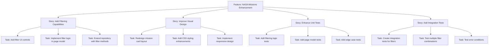

# NASA Missions Page Enhancement Delivery Plan

## Overview

This document outlines the delivery plan for enhancing the existing NASA Missions page in the SpaceGeeks application. The current implementation displays a list of NASA missions but lacks filtering capabilities and has basic styling.

## Feature Breakdown

The enhancement is broken down into the following epics and stories:

## Implementation Approach

### Phase 1: Backend Enhancement
1. Extend the `INasaMissionRepository` interface with filtering methods
2. Implement filtering logic in `InMemoryNasaMissionRepository`
3. Update `NasaMissionsModel` to handle filter parameters
4. Add unit tests for new backend functionality

### Phase 2: Frontend Enhancement
1. Add filter controls to the NASA Missions page
2. Improve the visual design of mission cards
3. Ensure responsive design for all device sizes
4. Implement client-side interactions for filters

### Phase 3: Testing Enhancement
1. Add comprehensive unit tests for all new functionality
2. Create integration tests for end-to-end verification
3. Verify existing tests still pass
4. Achieve >80% code coverage for NASA missions functionality

## Dependencies

- Existing NASA mission data structure
- Current CSS styling framework
- ASP.NET Core Razor Pages infrastructure
- xUnit testing framework

## Timeline

| Phase | Duration | Deliverables |
|-------|----------|--------------|
| Phase 1 | 3 days | Filtering backend functionality, unit tests |
| Phase 2 | 4 days | Enhanced UI/UX, responsive design |
| Phase 3 | 2 days | Comprehensive test coverage |
| **Total** | **9 days** | **Fully enhanced NASA Missions page** |

## Success Criteria

- Users can filter missions by status and date range
- Improved visual design enhances user experience
- All existing functionality remains intact
- New unit and integration tests pass
- Code coverage for NASA missions functionality exceeds 80%
- Page load performance is maintained or improved

## Risk Mitigation

| Risk | Mitigation Strategy |
|------|---------------------|
| Performance impact from filtering | Implement efficient filtering algorithms |
| UI conflicts with existing design | Follow established design patterns |
| Test coverage gaps | Implement thorough testing from the start |
| Breaking existing functionality | Maintain backward compatibility |