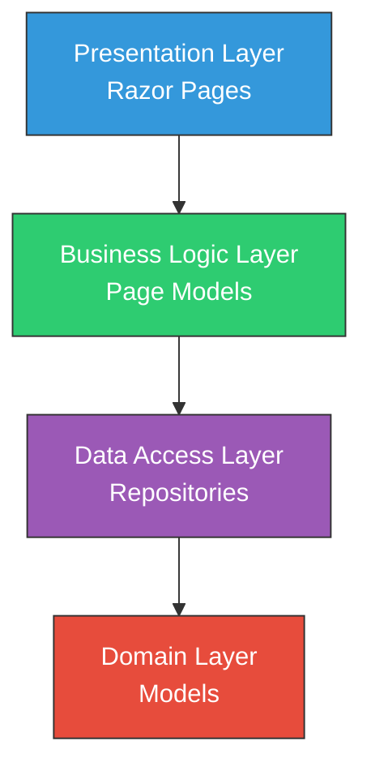

# NASA Curiosity Rover Mission Feature - Logical Architecture

## 1. Purpose

This document describes the logical architecture of the NASA Curiosity Rover mission feature, detailing the components, their responsibilities, and interactions within the layered architecture pattern of the SpaceGeeks application.

## 2. Architectural Layers

The solution follows the established layered architecture pattern with clear separation of concerns:

## 3. Component Responsibilities

### 3.1 Presentation Layer

#### 3.1.1 NasaMissions.cshtml
- **Description**: Razor Page template for displaying NASA missions
- **Responsibilities**:
  - Render the NASA missions page layout
  - Iterate through mission data and display using partial views
  - Maintain consistency with existing page structure

#### 3.1.2 _MissionCard.cshtml (Partial View)
- **Description**: Reusable partial view for displaying individual mission information
- **Responsibilities**:
  - Present mission data in a consistent card format
  - Display mission name, description, launch date, status, and image
  - Handle missing images with placeholder fallback
  - Present Curiosity Rover data identically to other missions

### 3.2 Business Logic Layer

#### 3.2.1 NasaMissionsModel (Page Model)
- **Description**: Page model handling logic for the NASA missions page
- **Responsibilities**:
  - Coordinate retrieval of NASA mission data through repository
  - Prepare data for presentation in the view
  - Maintain dependency injection pattern for repository access
  - No changes required as it works with extended repository interface

### 3.3 Data Access Layer

#### 3.3.1 INasaMissionRepository (Interface)
- **Description**: Interface defining contract for NASA mission data access
- **Responsibilities**:
  - Define method for retrieving all missions ordered by launch date
  - No changes required as existing interface suffices

#### 3.3.2 InMemoryNasaMissionRepository (Implementation)
- **Description**: Implementation providing access to NASA mission data from in-memory collection
- **Responsibilities**:
  - Store Curiosity Rover mission data alongside existing missions
  - Return complete mission list ordered by launch date
  - Maintain immutability of data records

### 3.4 Domain Layer

#### 3.4.1 NasaMission (Record)
- **Description**: Immutable record representing a NASA space mission
- **Responsibilities**:
  - Define structure for NASA mission data
  - No changes required as existing structure accommodates Curiosity Rover data
  - Properties: Name, Description, LaunchDate, EndDate, Status, ImagePath

## 4. Data Flow

1. User requests the NASA Missions page
2. NasaMissionsModel page model is instantiated by the framework
3. Page model requests mission data through INasaMissionRepository interface
4. InMemoryNasaMissionRepository retrieves all missions including Curiosity Rover
5. Data is ordered by launch date and returned to page model
6. Page model makes data available to view
7. NasaMissions.cshtml iterates through missions
8. For each mission, _MissionCard partial view renders mission details
9. User sees Curiosity Rover listed chronologically with other missions

## 5. Integration Points

### 5.1 Repository Extension
- The InMemoryNasaMissionRepository is extended to include Curiosity Rover data
- No interface changes required
- Maintains existing data ordering (by launch date)

### 5.2 UI Consistency
- Curiosity Rover data is presented using existing _MissionCard partial view
- No UI component changes required
- Maintains visual consistency with other missions

## 6. Design Principles

### 6.1 Consistency
- Follows existing architectural patterns and naming conventions
- Uses same data structures and interfaces as existing missions
- Maintains identical UI presentation

### 6.2 Extensibility
- New mission data can be added by extending the in-memory collection
- No code modifications required for additional missions with same data structure
- Repository pattern allows for future implementation changes

### 6.3 Separation of Concerns
- Each layer has distinct responsibilities
- Presentation concerns separated from business logic
- Data access isolated from domain logic