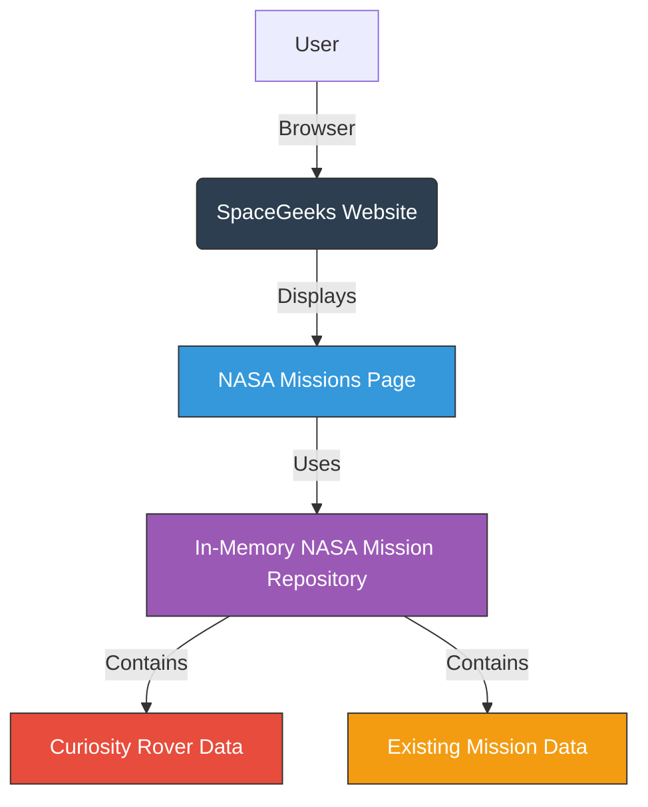

# NASA Curiosity Rover Mission Feature - System Context

## 1. Purpose

This document describes the system context for the NASA Curiosity Rover mission feature within the SpaceGeeks application. It shows where the new feature fits in relation to the existing system components and external entities.

## 2. System Context Diagram

## 3. External Entities

### 3.1 Users
- **Primary Users**: Students, educators, and space enthusiasts accessing the website to learn about NASA missions
- **Interaction**: Browse the NASA missions page to view information about the Curiosity Rover and other missions

## 4. System Components

### 4.1 SpaceGeeks Website
- **Description**: Main web application built with ASP.NET Core Razor Pages
- **Responsibilities**: 
  - Serve web pages to users
  - Process user requests
  - Render NASA mission information

### 4.2 NASA Missions Page
- **Description**: Specific page within the SpaceGeeks website dedicated to displaying NASA missions
- **Responsibilities**:
  - Display list of NASA missions including Curiosity Rover
  - Use consistent UI components for mission presentation
  - Retrieve data from the repository layer

### 4.3 In-Memory NASA Mission Repository
- **Description**: Data access layer component storing NASA mission information
- **Responsibilities**:
  - Store and retrieve NASA mission data
  - Include Curiosity Rover mission alongside existing missions
  - Provide data ordered by launch date

### 4.4 Curiosity Rover Data
- **Description**: New data entity representing the NASA Curiosity Rover mission
- **Responsibilities**:
  - Provide accurate information about the Curiosity Rover mission
  - Conform to existing data model structure
  - Integrate seamlessly with existing mission data

## 5. Relationships

1. **Users** interact with the **SpaceGeeks Website** through web browsers
2. **SpaceGeeks Website** contains the **NASA Missions Page**
3. **NASA Missions Page** depends on the **In-Memory NASA Mission Repository** for data
4. **In-Memory NASA Mission Repository** contains both **Curiosity Rover Data** and **Existing Mission Data**
5. **Curiosity Rover Data** is presented consistently with **Existing Mission Data**

## 6. Constraints and Assumptions

- The feature must integrate with the existing architecture without modifying core components
- No external dependencies are introduced
- All data remains in-memory with no external database or API calls
- The UI must remain consistent with existing mission presentations