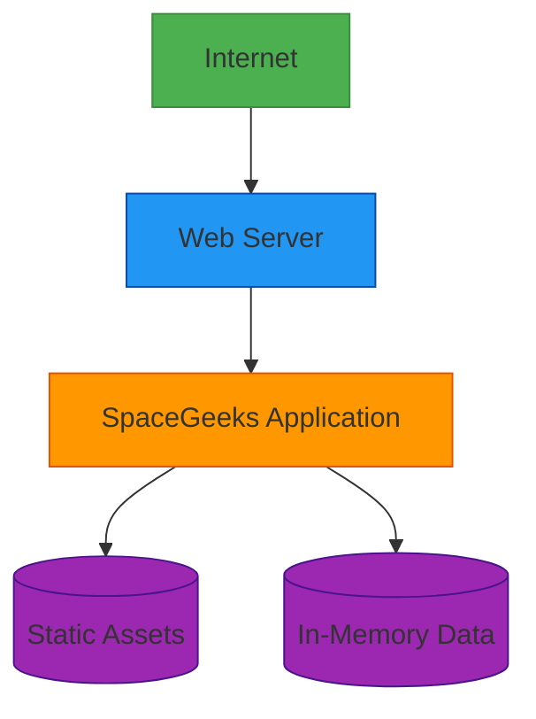

# Deployment Architecture

## Overview

The SpaceGeeks website is designed for simple deployment with minimal infrastructure requirements. The current architecture leverages a self-hosted model where the application contains all necessary components within a single deployable unit.

## Deployment Model

## Hosting Environment

### Current Deployment Target
- Platform: Any environment supporting ASP.NET Core 6.0+
- Operating Systems: Windows, Linux, macOS
- Web Server: Kestrel (built-in) or IIS/Apache/Nginx (reverse proxy)

### Resource Requirements
- CPU: 1 core minimum
- Memory: 512MB RAM minimum
- Storage: 100MB disk space
- Network: HTTP/HTTPS access

## Deployment Process

### Build Process
1. Compile C# code using .NET SDK
2. Bundle static assets (images, CSS, JavaScript)
3. Package application as self-contained executable or framework-dependent deployment
4. Include all data files in deployment package

### Deployment Steps
1. Stop existing application instance (if running)
2. Deploy new application files
3. Start application
4. Verify health checks pass

### Rollback Procedure
1. Stop current application instance
2. Restore previous version files
3. Start application
4. Verify functionality

## Scalability Considerations

### Vertical Scaling
- Increase resources (CPU, memory) on existing server
- Limited by single-server constraints

### Horizontal Scaling
- Current in-memory architecture limits horizontal scaling
- Would require shared data store for multiple instances

## Monitoring and Health Checks

### Application Health
- Built-in ASP.NET Core health checks
- Custom health endpoints for dependencies

### Performance Monitoring
- Response time metrics
- Memory and CPU usage tracking
- Error rate monitoring

### Logging
- Structured application logs
- Request/response logging
- Error and exception tracking

## Backup and Recovery

### Data Backup
- Static assets included in source control
- Data models defined in code
- No external database backup required

### Disaster Recovery
- Redeploy from source control
- Restore from version control history
- Minimal recovery time objective (RTO)

## Security Considerations

### Network Security
- HTTPS enforcement
- Secure headers configuration
- Protection against common web attacks

### Application Security
- Input validation
- Output encoding
- Secure configuration management

## Environment Configuration

### Development
- Local development environment
- Debug logging enabled
- Development data sets

### Production
- Optimized runtime settings
- Minimal logging
- Production data sets

## Continuous Integration/Deployment

### CI Pipeline
- Automated builds on code changes
- Unit and integration testing
- Code quality checks

### CD Pipeline
- Automated deployment to staging
- Manual approval for production
- Rollback capabilities

## Future Considerations

### Cloud Deployment
- Containerization (Docker) for consistent environments
- Kubernetes orchestration for scalability
- Cloud provider managed services

### Database Integration
- Migration from in-memory to persistent storage
- Support for larger datasets
- Improved scalability and reliability

### Content Delivery Network (CDN)
- Improved global performance
- Reduced server load
- Better user experience