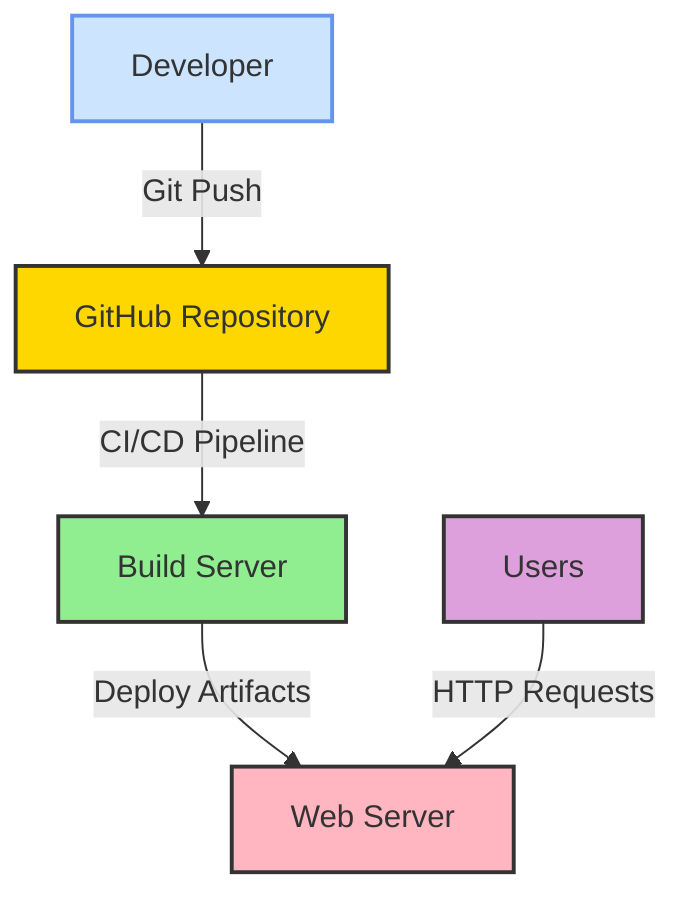

# Deployment Architecture

## Overview

This document describes the deployment architecture for the SpaceGeeks website, including hosting considerations, deployment processes, and operational characteristics.

## Deployment Model



## Hosting Environment

### Current State
- **Platform**: Self-contained .NET 7 application
- **Hosting Model**: Can be hosted on any platform supporting .NET 7
- **Server Requirements**: 
  - .NET 7 Runtime
  - HTTP server capability (IIS, Nginx, Apache, etc.)
  - Read access to application files

### Recommended Hosting Options

#### Development
- **Platform**: Local machine with .NET 7 SDK
- **Server**: Kestrel (built-in ASP.NET Core server)
- **Deployment**: Direct execution via `dotnet run`

#### Production
- **Platform Options**:
  - Azure App Service
  - AWS Elastic Beanstalk
  - Google Cloud Run
  - Traditional VM with reverse proxy (Nginx/Apache)
- **Containerization**: Docker support for consistent deployment
- **Scaling**: Horizontal scaling through load balancer

## Deployment Package

### File Structure
```
SpaceGeeks/
├── SpaceGeeks.dll              # Main application assembly
├── SpaceGeeks.runtimeconfig.json  # Runtime configuration
├── SpaceGeeks.deps.json        # Dependencies manifest
├── appsettings.json            # Configuration files
├── wwwroot/                    # Static assets (images, CSS, JS)
│   ├── images/
│   ├── css/
│   └── js/
├── data/                       # Celestial object data files (new)
│   ├── planets.json
│   ├── stars.json
│   └── constellations.json
└── ...
```

### Build Process
1. **Compilation**: `dotnet publish -c Release`
2. **Optimization**: Ahead-of-Time compilation for improved startup time
3. **Packaging**: Self-contained deployment bundle
4. **Testing**: Automated tests executed during build

## Configuration Management

### Environment-Specific Settings
- **Development**: `appsettings.Development.json`
- **Production**: `appsettings.json` or environment variables
- **Key Settings**:
  - Logging levels
  - Custom error page behavior
  - Static file caching settings

### Data Configuration
- Celestial object data stored in version-controlled JSON files
- No external database dependencies for core functionality
- Data updates require redeployment

## Scaling Considerations

### Vertical Scaling
- **Current Capability**: Single-instance deployment
- **Resource Needs**: Minimal CPU/memory requirements
- **Limitations**: No built-in session state (stateless by design)

### Horizontal Scaling
- **Stateless Design**: Enables load balancing across multiple instances
- **Static Content**: Can be served via CDN for improved performance
- **Session Management**: Not required for current functionality

## Monitoring and Observability

### Built-in Features
- **Health Checks**: ASP.NET Core health monitoring endpoints
- **Logging**: Structured logging via ILogger interface
- **Error Handling**: Standard exception handling middleware

### Recommended Enhancements
- **Application Insights**: For production monitoring
- **Custom Metrics**: Track popular celestial objects viewed
- **Performance Counters**: Monitor response times and throughput

## Backup and Recovery

### Data Protection
- **Source Control**: All data and code in Git repository
- **Version History**: Complete change tracking via commits
- **Disaster Recovery**: Simple redeployment from repository

### Operational Procedures
- **Deployment Rollback**: Previous versions available via Git tags
- **Data Validation**: Automated tests verify data integrity
- **Security Updates**: Regular dependency updates via Dependabot

## Security Considerations

### Application Security
- **Input Validation**: Built-in ASP.NET Core request validation
- **Cross-Site Scripting**: Razor's automatic HTML encoding
- **CSRF Protection**: Built-in anti-forgery token support

### Deployment Security
- **File Permissions**: Least privilege principle for application files
- **Network Security**: HTTPS enforcement in production
- **Secrets Management**: No hardcoded secrets in codebase

## Update Process

### Typical Deployment Steps
1. **Code Changes**: Developer commits changes to feature branch
2. **Pull Request**: Code review and automated testing
3. **Merge**: Changes merged to main branch
4. **CI/CD**: Automated build and deployment pipeline
5. **Verification**: Smoke tests confirm successful deployment

### Data Updates
- **Process**: Modify JSON data files in repository
- **Validation**: Unit tests verify data structure and content
- **Deployment**: Same process as code changes

## Performance Optimization

### Caching Strategy
- **Static Assets**: Browser and CDN caching with proper headers
- **Data**: In-memory caching in repository implementations
- **Responses**: Output caching for frequently accessed pages

### Resource Optimization
- **Image Compression**: WebP format for optimal quality/size ratio
- **Bundle Minification**: CSS and JavaScript minification
- **Lazy Loading**: Images loaded as needed

## Future Considerations

### Potential Enhancements
1. **Database Integration**: For dynamic content management
2. **Search Service**: Elasticsearch for enhanced search capabilities
3. **Microservices**: Decompose functionality into separate services
4. **Mobile Optimization**: Progressive Web App features

### Migration Path
- Current monolithic design supports gradual migration to microservices
- Data layer abstraction facilitates backend changes
- API-first approach enables mobile app development