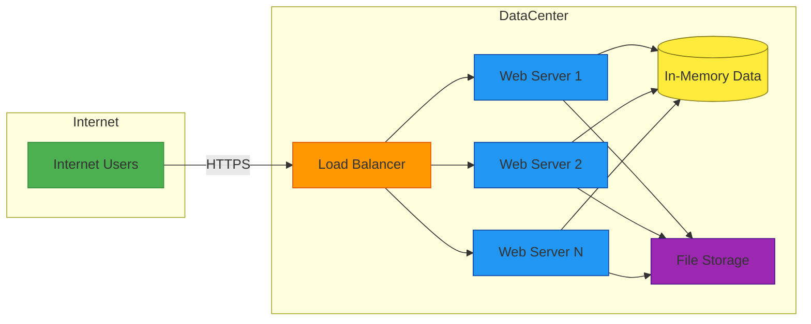
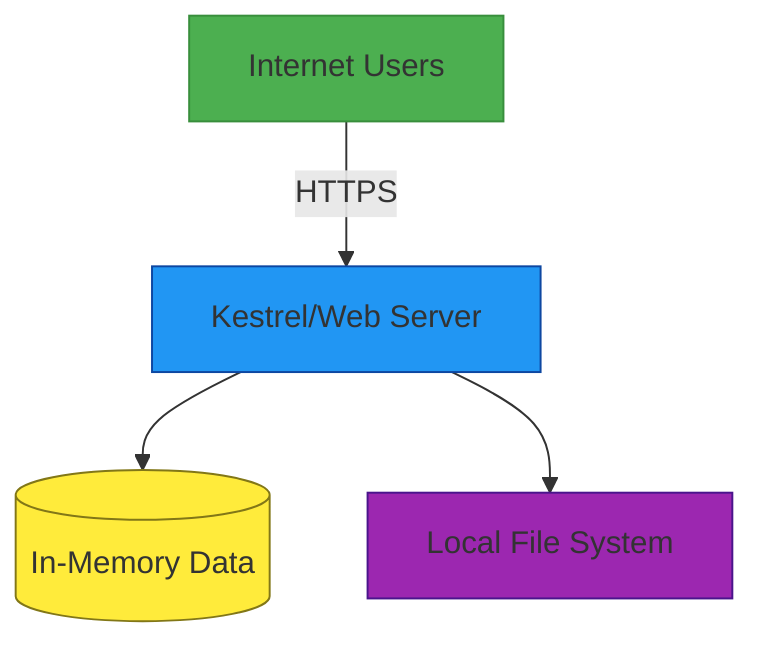

# Deployment Architecture

## Deployment Diagram

## Current Deployment (Single Server)

The current SpaceGeeks website is deployed as a single ASP.NET Core application running on one server:

## Deployment Components

### Web Servers
ASP.NET Core applications can be hosted in several ways:
1. **Kestrel** - Cross-platform web server included with ASP.NET Core
2. **IIS** - Windows-based web server
3. **nginx/Apache** - Reverse proxy configurations with Kestrel

Each web server runs the complete SpaceGeeks application with all its components in memory.

### Load Balancer
For scaled deployments, a load balancer distributes incoming requests across multiple web servers to:
- Improve performance by distributing load
- Increase availability through redundancy
- Enable rolling updates with zero downtime

### Data Storage
Currently, all data is stored in-memory within each web server instance:
- Planets data is stored in `InMemoryPlanetRepository`
- Future stars and constellations data will be stored similarly
- Each server maintains its own copy of the data

### File Storage
Static assets (images, CSS, JavaScript) are stored on the local file system of each web server:
- Images are located in `wwwroot/images/`
- CSS files are in `wwwroot/css/`
- JavaScript files are in `wwwroot/js/`

## Scaling Considerations

### Vertical Scaling
Current architecture supports vertical scaling by:
- Increasing CPU and memory resources
- Optimizing data structures and algorithms
- Implementing caching strategies

### Horizontal Scaling
To scale horizontally, modifications would be needed:
- Centralize data storage in a shared database
- Implement distributed caching for session data
- Use shared storage for static assets (CDN)

## Deployment Process

### Build Process
1. Compile the ASP.NET Core application
2. Package static assets
3. Create deployment artifacts

### Release Process
1. Stop the web server
2. Deploy new application files
3. Restart the web server
4. Verify functionality

For zero-downtime deployments with multiple servers:
1. Remove one server from the load balancer pool
2. Update the removed server
3. Return the updated server to the pool
4. Repeat for remaining servers

## Environment Configuration

### Development
- Local development machine
- Development-specific configuration in `appsettings.Development.json`
- Detailed error reporting enabled

### Production
- Publicly accessible server(s)
- Production configuration in `appsettings.json`
- Error reporting minimized for security
- HTTPS enforced

## Monitoring and Observability

### Health Checks
ASP.NET Core health checks can monitor:
- Application responsiveness
- Data repository availability
- Static file serving capability

### Logging
Structured logging captures:
- Request information
- Error details
- Performance metrics
- Security events

### Performance Metrics
Key metrics to monitor:
- Response times
- Error rates
- Memory usage
- CPU utilization

## Backup and Recovery

### Data Backup
Since data is currently in-memory and static:
- Source code represents the master data
- Version control provides history and recovery capability
- Regular backups of the entire application directory

### Disaster Recovery
Recovery process involves:
- Restoring from backup
- Re-deploying the application
- Verifying functionality

## Security Considerations

### Network Security
- All traffic should be encrypted with HTTPS
- Firewalls should restrict unnecessary ports
- Load balancers should provide DDoS protection

### Application Security
- Keep ASP.NET Core framework updated
- Validate all user inputs
- Sanitize output to prevent XSS attacks
- Secure headers should be configured

### Data Security
- Since data is public educational content, encryption-at-rest is not critical
- Access controls should prevent unauthorized modifications