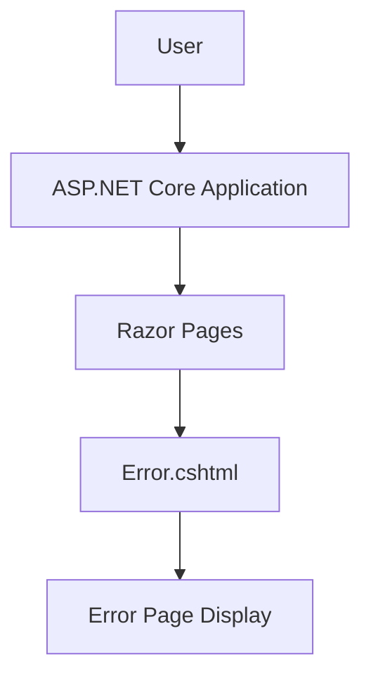

# Error Page Update - High-Level Design

## 1. Overview

This document describes the update to the error page message in the SpaceGeeks application to display "Houston, we have a problem" instead of "An error occurred".

### Business Driver
- Ticket: [#33](https://github.com/gjduggins/SpaceGeeks/issues/33)
- Enhance user experience by aligning error messaging with the space theme of the application

### In Scope
- Updating the error page message text
- Maintaining existing error page functionality

### Out of Scope
- Changes to error handling logic
- Changes to error page styling
- Changes to other error messages in the application

## 2. Context and Goals

### Goals
- Improve brand consistency by using space-themed language
- Maintain clear communication of error states to users

### Non-goals
- Changing the underlying error handling mechanism
- Modifying the visual appearance of the error page

## 3. Architecture Overview

The SpaceGeeks application uses ASP.NET Core Razor Pages for its web interface. When an error occurs, the application routes to the Error.cshtml page which displays an error message to the user.

## 4. Component Design

### Error Page Component

- **Responsibility**: Display error information to users when an exception occurs
- **Public Interface**: HTTP GET endpoint served by ASP.NET Core routing
- **Dependencies**: None (self-contained Razor page)
- **Caching**: No caching

## 5. Data Design

No data changes are involved in this update.

## 6. API and Contract Design

No API changes are involved in this update.

## 7. Security Considerations

No security implications arise from changing the error message text.

## 8. Monitoring and Observability

No monitoring changes are required for this update.

## 9. Failure Modes and Resilience

This change does not affect application resilience or failure modes.

## 10. Deployment and Operations

The change will be deployed as part of the normal application deployment process.

### Rollout Approach
- Standard deployment through CI/CD pipeline
- No special rollout considerations

### Rollback Plan
- Revert the pull request and redeploy previous version if issues arise

## Review and Approval

This change has been reviewed as part of the pull request process.