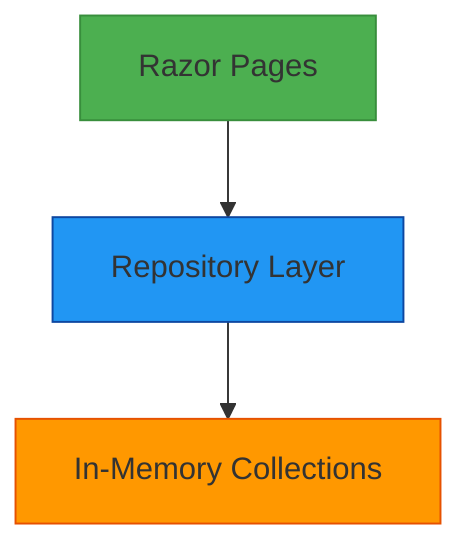
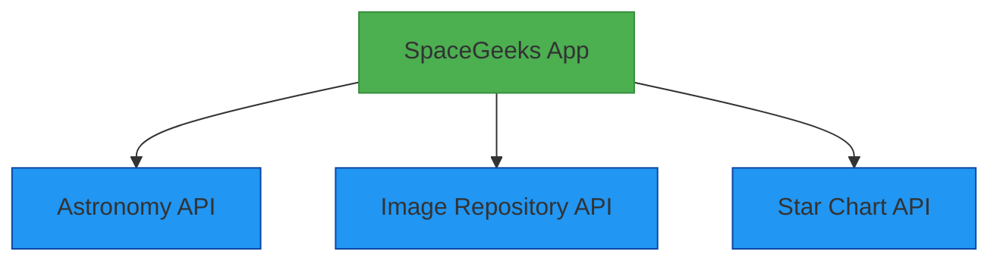
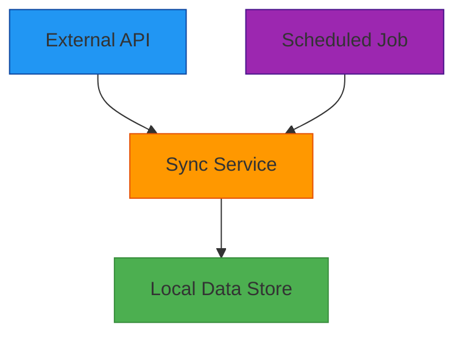

# Integration Architecture

## Overview

The SpaceGeeks website currently operates as a standalone application with no external integrations. All data is stored in-memory within the application, and all content is served directly to users without dependency on external systems.

## Current State

### Internal Integrations



The application has a clean internal architecture with:
- Razor Pages handling presentation logic
- Repository pattern abstracting data access
- In-memory collections storing all data

### External Dependencies

Currently, the application has minimal external dependencies:
- ASP.NET Core framework
- Standard web browser technologies (HTML, CSS, JavaScript)
- Bootstrap CSS framework (delivered via CDN or local copy)

## Proposed Integrations

### Future Integration Opportunities

#### External Astronomy APIs
Potential integrations with external astronomy databases could enrich the content:



1. **Astronomy Data APIs**
   - NASA APIs for accurate celestial data
   - SIMBAD database for comprehensive star catalogs
   - Benefits: Real-time data, extensive catalogs
   - Challenges: API rate limits, data consistency

2. **Image Repositories**
   - Integration with Hubble or James Webb Space Telescope image galleries
   - Creative Commons image sources
   - Benefits: High-quality imagery, regular updates
   - Challenges: Attribution requirements, bandwidth costs

3. **Star Mapping Services**
   - Integration with interactive star chart providers
   - Real-time sky maps based on user location
   - Benefits: Enhanced user experience, educational value
   - Challenges: Geographic data handling, mobile optimization

### Integration Patterns

#### API Client Pattern
For integrating with external REST APIs:

```csharp
public interface IAstronomyApiClient
{
    Task<IEnumerable<Star>> GetStarsAsync(string constellation);
    Task<Star> GetStarDetailsAsync(string starName);
    Task<IEnumerable<Constellation>> GetConstellationsAsync();
}
```

#### Data Synchronization
For periodically updating local data from external sources:



## Data Flow

### Current Data Flow

1. **Application Startup**
   ```
   Program.cs → Dependency Injection Setup → Repository Initialization
   ```

2. **User Request Processing**
   ```
   HTTP Request → Razor Page → Repository → In-Memory Data → HTML Response
   ```

3. **Data Presentation**
   ```
   Data Model → Razor View → HTML/CSS/JavaScript → Browser Rendering
   ```

### Future Data Flow with Integrations

1. **API Integration Flow**
   ```
   User Request → Controller/Service → API Client → External Service 
   → JSON Response → Data Transformation → View Model → HTML Response
   ```

2. **Background Sync Flow**
   ```
   Scheduler → Sync Service → External API → Data Processing 
   → Local Data Store Update
   ```

## Integration Technologies

### HTTP Clients
- HttpClient for REST API communications
- Polly for resilience and transient fault handling
- Newtonsoft.Json or System.Text.Json for serialization

### Messaging (Future Consideration)
- Message queues for asynchronous processing
- Event-driven architecture for real-time updates
- Webhooks for external system notifications

### Caching Strategies
- In-memory caching for API responses
- Distributed caching for scalability
- Cache invalidation policies

## Error Handling and Resilience

### Circuit Breaker Pattern
Prevent cascading failures when external services are unavailable:

```csharp
var circuitBreakerPolicy = Policy
    .Handle<HttpRequestException>()
    .CircuitBreaker(
        exceptionsAllowedBeforeBreaking: 2,
        durationOfBreak: TimeSpan.FromMinutes(1)
    );
```

### Retry Logic
Handle transient failures gracefully:

```csharp
var retryPolicy = Policy
    .Handle<HttpRequestException>()
    .WaitAndRetryAsync(
        retryCount: 3,
        sleepDurationProvider: retryAttempt => TimeSpan.FromSeconds(Math.Pow(2, retryAttempt))
    );
```

### Fallback Mechanisms
Provide graceful degradation when integrations fail:

```csharp
var fallbackPolicy = Policy
    .Handle<Exception>()
    .FallbackAsync(fallbackAction: async ct => 
    {
        // Return cached or default data
    });
```

## Security Considerations for Integrations

### API Keys and Secrets
- Secure storage of API credentials
- Environment-specific configuration
- Regular credential rotation

### Data Validation
- Validate all external data before processing
- Sanitize data before display
- Protect against injection attacks

### Rate Limiting Compliance
- Respect external API rate limits
- Implement client-side throttling
- Monitor usage quotas

## Monitoring and Observability

### Integration Metrics
- API response times
- Success/failure rates
- Data freshness indicators

### Logging
- Integration point activity
- Error details for troubleshooting
- Performance metrics

### Alerting
- Integration failure notifications
- Performance degradation alerts
- Quota limit warnings

## Deployment Considerations

### Configuration Management
- Environment-specific integration settings
- Secure secret management
- Feature flagging for integration rollouts

### Testing Strategy
- Integration testing with external services
- Mock services for unit testing
- Contract testing for API compatibility

### Rollback Procedures
- Isolation of integration-specific code
- Quick disablement of problematic integrations
- Data consistency during rollbacks

## Future Roadmap

### Phase 1: Basic API Integration
- Implement simple REST client for astronomy data
- Add basic caching layer
- Introduce circuit breaker pattern

### Phase 2: Enhanced Integration Features
- Add background synchronization
- Implement advanced caching strategies
- Add comprehensive monitoring

### Phase 3: Real-time Capabilities
- WebSocket connections for live data
- Push notifications for celestial events
- Interactive sky maps