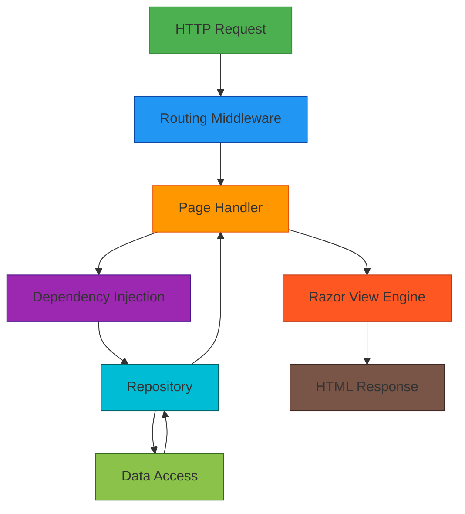
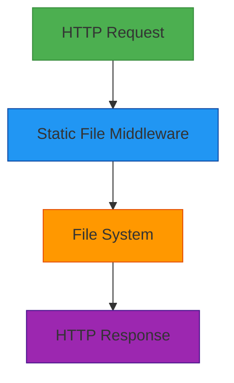

# Integration Architecture

## 1. Overview

This document describes the integration architecture of the SpaceGeeks website, detailing how different components interact internally and any external integrations.

For detailed information about the NASA Missions feature integration, please see the [NASA Missions Integration Architecture](./nasa-missions-integration.md).

## 2. Internal Integration Patterns

### 2.1 Dependency Injection
The primary integration mechanism within the application is .NET's built-in dependency injection container.

**Registration in Program.cs:**
```csharp
builder.Services.AddSingleton<IPlanetRepository, InMemoryPlanetRepository>();
builder.Services.AddSingleton<INasaMissionRepository, InMemoryNasaMissionRepository>();
```

**Consumption in Page Models:**
```csharp
public class NasaMissionsModel : PageModel
{
    private readonly INasaMissionRepository _repo;
    
    public NasaMissionsModel(INasaMissionRepository repo)
    {
        _repo = repo;
    }
}
```

**Benefits:**
- Loose coupling between components
- Easy testing through mocking
- Clear dependency visibility
- Automatic lifetime management

### 2.2 Repository Pattern
Data access is abstracted through repository interfaces, allowing for potential future changes in data storage without affecting consuming code.

**Interface Definition:**
```csharp
public interface INasaMissionRepository
{
    IReadOnlyList<NasaMission> GetAllOrderedByLaunchDate();
}
```

**Implementation:**
```csharp
public sealed class InMemoryNasaMissionRepository : INasaMissionRepository
{
    public IReadOnlyList<NasaMission> GetAllOrderedByLaunchDate() =>
        _missions.OrderBy(m => m.LaunchDate).ToArray();
}
```

## 3. External Integrations

### 3.1 Current State
The SpaceGeeks application currently has no external integrations. All data is statically defined within the application code and all assets are served locally.

### 3.2 Potential Future Integrations

#### NASA Open APIs
Could integrate with NASA's open APIs to provide real-time or updated mission data:
- **Endpoint**: https://api.nasa.gov/
- **Authentication**: API key required
- **Data Types**: Astronomy Picture of the Day, Mars Rover photos, etc.

#### Image Hosting Services
Could offload image storage to cloud services:
- **Services**: AWS S3, Azure Blob Storage, Cloudinary
- **Benefits**: Improved performance, reduced bandwidth costs
- **Considerations**: Additional complexity, external dependency

#### Analytics Services
Could integrate analytics to understand user behavior:
- **Services**: Google Analytics, Application Insights
- **Data Collected**: Page views, user paths, device information
- **Privacy Considerations**: GDPR/CCPA compliance

## 4. Data Flow Patterns

### 4.1 Request Processing Flow



### 4.2 Static Asset Serving



## 5. Interface Contracts

### 5.1 Repository Interfaces

#### INasaMissionRepository
```csharp
public interface INasaMissionRepository
{
    /// <summary>Returns all NASA missions ordered by ascending launch date.</summary>
    IReadOnlyList<NasaMission> GetAllOrderedByLaunchDate();
}
```

**Contract Guarantees:**
- Returns immutable list of missions
- Missions ordered by launch date (ascending)
- Never returns null (empty list if no data)
- Thread-safe for concurrent access

#### IPlanetRepository
```csharp
public interface IPlanetRepository
{
    /// <summary>Returns all planets ordered by distance from the sun.</summary>
    IReadOnlyList<Planet> GetAllOrderedByDistanceFromSun();
}
```

**Contract Guarantees:**
- Returns immutable list of planets
- Planets ordered by distance from sun (ascending)
- Never returns null (empty list if no data)
- Thread-safe for concurrent access

### 5.2 Page Model Interfaces
Page models implement the Razor Pages framework interfaces implicitly:
- `IActionResult` for page responses
- Parameter binding through property attributes
- Model validation through data annotations

## 6. Communication Protocols

### 6.1 HTTP/HTTPS
Primary protocol for user communication:
- **Version**: HTTP/1.1 and HTTP/2 supported
- **Security**: TLS 1.2+ encryption required
- **Methods**: GET for content retrieval
- **Status Codes**: Standard HTTP status codes

### 6.2 Method Calls
Internal component communication:
- **Pattern**: Direct method invocation
- **Security**: Same-process, no network security concerns
- **Performance**: Lowest latency communication method

### 6.3 File I/O
Static asset serving:
- **Protocol**: Direct file system access
- **Caching**: HTTP caching headers for browser caching
- **Compression**: Gzip/Brotli compression for text assets

## 7. Integration Security

### 7.1 Internal Communications
Since all communication happens within the same process:
- No network interception risks
- No authentication required between components
- Shared memory security model

### 7.2 External Communication
Currently no external communication, but if added would require:
- Transport encryption (TLS)
- Authentication and authorization
- Input validation and sanitization
- Rate limiting and throttling
- Monitoring and logging

## 8. Error Handling in Integrations

### 8.1 Repository Errors
Repository implementations should handle errors gracefully:
- Data validation at construction time
- Fail-fast initialization
- Clear error messaging

### 8.2 Page Model Errors
Page models handle integration errors through:
- Try/catch patterns for recoverable errors
- Graceful degradation when data unavailable
- User-friendly error pages

### 8.3 View Rendering Errors
Razor views handle errors through:
- Null-checking for data
- Fallback values for missing data
- Error boundaries in partial views

## 9. Monitoring Integration Points

### 9.1 Built-in Monitoring
Current integration points are monitored through:
- Application logging
- Exception tracking
- Performance counters

### 9.2 Future Monitoring Enhancements
Could add specialized monitoring for integrations:
- Distributed tracing
- Integration-specific metrics
- Health check endpoints

## 10. Integration Testing Strategy

### 10.1 Repository Testing
Repositories are tested in isolation:
- Data integrity verification
- Ordering correctness
- Immutability guarantees

### 10.2 Page Model Testing
Page models are tested with mocked repositories:
- Request processing logic
- Data transformation
- Error handling

### 10.3 Integration Testing
Full stack testing through:
- WebApplicationFactory for in-memory testing
- HTML parsing for content verification
- End-to-end scenario validation

## 11. Evolution Strategy

### 11.1 Backward Compatibility
Interface contracts are designed for stability:
- Additive changes preferred
- Deprecation warnings before removal
- Versioning for breaking changes

### 11.2 Migration Patterns
For replacing integrations:
- Adapter pattern for interface compatibility
- Gradual migration strategies
- Feature flags for controlled rollouts