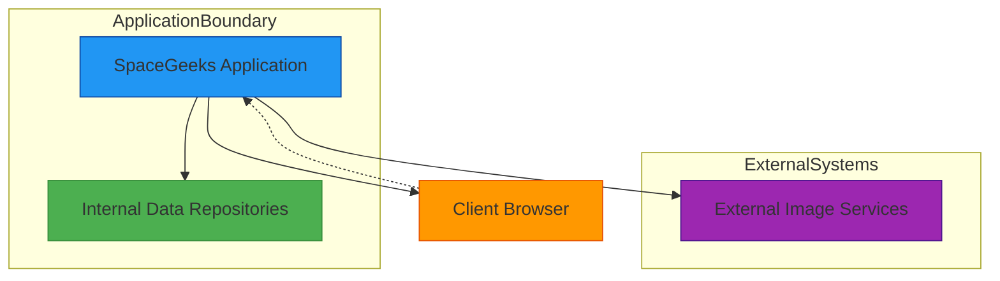
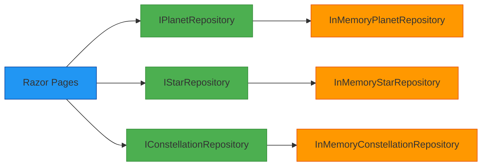
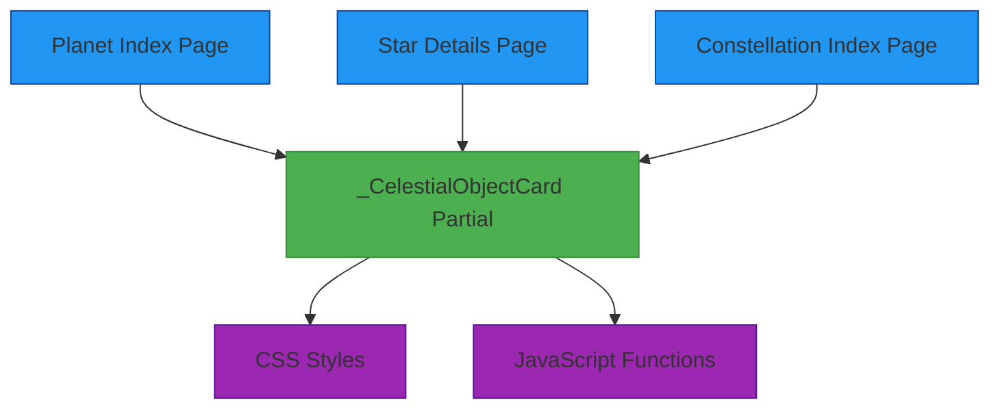
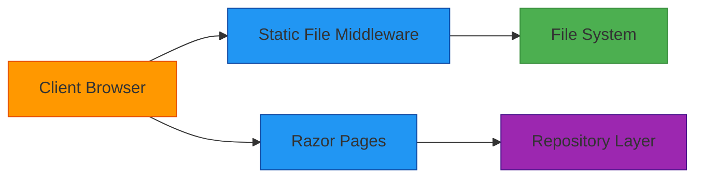

# Integration Architecture

## Integration Diagram



## Internal Integrations

### Repository Pattern Integration

The SpaceGeeks application uses the repository pattern to abstract data access:



This pattern allows:
- Decoupling of presentation logic from data access logic
- Easy substitution of data sources
- Consistent interface for accessing different types of celestial objects
- Simplified unit testing through mock repositories

### Dependency Injection Integration

ASP.NET Core's built-in dependency injection container integrates all components:

```csharp
// Program.cs
builder.Services.AddSingleton<IPlanetRepository, InMemoryPlanetRepository>();
builder.Services.AddSingleton<IStarRepository, InMemoryStarRepository>();
builder.Services.AddSingleton<IConstellationRepository, InMemoryConstellationRepository>();
```

This enables:
- Automatic resolution of repository dependencies in page handlers
- Centralized configuration of component lifetimes
- Consistent instantiation and disposal of services

### UI Component Integration

Shared UI components are integrated through partial views:



This approach ensures:
- Consistent presentation of celestial object information
- Reusable UI logic across different pages
- Centralized styling and behavior management

## External Integrations

### Static Asset Delivery

The application integrates with the web server's static file middleware:



Configuration in `Program.cs`:
```csharp
app.UseStaticFiles(); // Enables serving of static assets
```

This integration provides:
- Efficient delivery of images, CSS, and JavaScript files
- Automatic MIME type detection
- Conditional HTTP headers for caching

### Client-Side Integration

Browser-side integrations enhance user experience:

#### CSS Integration
- Cascading Style Sheets provide consistent styling
- Responsive design adapts to different screen sizes
- CSS variables enable theme customization

#### JavaScript Integration
- Client-side validation improves form usability
- Dynamic content loading enhances performance
- Interactive elements improve engagement

#### Image Integration
- Responsive images adapt to device capabilities
- Alternative text provides accessibility
- Lazy loading improves initial page performance

## API Considerations

While the current implementation is server-rendered, the architecture supports future API development:

### Potential REST API Endpoints
```
GET /api/planets                 # List all planets
GET /api/planets/{id}            # Get specific planet
GET /api/stars                   # List all stars
GET /api/stars/{id}              # Get specific star
GET /api/constellations          # List all constellations
GET /api/constellations/{id}     # Get specific constellation
```

### JSON Response Format
```json
{
  "name": "Sirius",
  "rightAscension": "06h45m08.9s",
  "declination": "−16°42′58″",
  "apparentMagnitude": -1.46,
  "distanceLightYears": 8.66,
  "spectralClass": "A1V",
  "links": {
    "self": "/api/stars/sirius",
    "constellation": "/api/constellations/canis-major"
  }
}
```

## Data Exchange Formats

### Internal Data Representation
Celestial objects are represented as immutable records:
```csharp
public sealed record Star(
    string Name,
    string RightAscension,
    string Declination,
    double ApparentMagnitude,
    double DistanceLightYears,
    string SpectralClass,
    string ImagePath
);
```

### View Model Transformation
Page models transform domain models for presentation:
```csharp
public class StarViewModel
{
    public string Name { get; init; }
    public string DisplayName { get; init; }
    public string Description { get; init; }
    // ... additional presentation-focused properties
}
```

## Integration Patterns

### Request/Response Pattern
- Client browser requests a page URL
- Server processes the request through routing
- Appropriate page handler executes
- Data is retrieved through repository interfaces
- HTML response is rendered and returned

### Event-Driven Pattern (Client-Side)
- User interactions trigger JavaScript events
- Events modify DOM elements or make AJAX requests
- Responses update parts of the page dynamically

### Publish/Subscribe Pattern (Future Enhancement)
- Changes to celestial data could notify interested components
- Real-time updates for collaborative features
- WebSockets for persistent connections

## Integration Security

### Cross-Origin Resource Sharing (CORS)
If APIs are added, CORS policies will control access:
```csharp
app.UseCors(policy => policy
    .WithOrigins("https://spacegeeks.example.com")
    .AllowAnyMethod()
    .AllowAnyHeader());
```

### Content Security Policy (CSP)
Headers will control resource loading:
```
Content-Security-Policy: default-src 'self'; img-src 'self' data: https:;
```

## Monitoring and Observability Integrations

### Logging Integration
- Structured logging through ILogger interface
- Integration with monitoring platforms (Application Insights, etc.)
- Correlation IDs for request tracing

### Health Check Integration
- Built-in ASP.NET Core health checks
- Custom health checks for repository availability
- Kubernetes readiness/liveness probes

### Metrics Integration
- Performance counters for response times
- Throughput measurements
- Error rate tracking

## Future Integration Opportunities

### Database Integration
Replacing in-memory repositories with database-backed implementations:
- Entity Framework Core for ORM
- Connection pooling for performance
- Migration system for schema evolution

### External API Integration
Consuming third-party astronomy APIs:
- NASA APIs for real-time data
- Stellar catalog services for extended datasets
- Image services for high-resolution assets

### Search Service Integration
Implementing full-text search capabilities:
- Elasticsearch for complex queries
- Azure Search for cloud-native solution
- Lucene for embedded search

### Caching Integration
Improving performance through caching:
- Redis for distributed caching
- Memory cache for frequently accessed data
- CDN integration for static assets

### Authentication Service Integration
Adding user accounts and personalization:
- OAuth providers (Google, Facebook, etc.)
- IdentityServer for custom identity provider
- Role-based access control

These integration points are designed to be modular and replaceable, allowing the system to evolve while maintaining stability and performance.