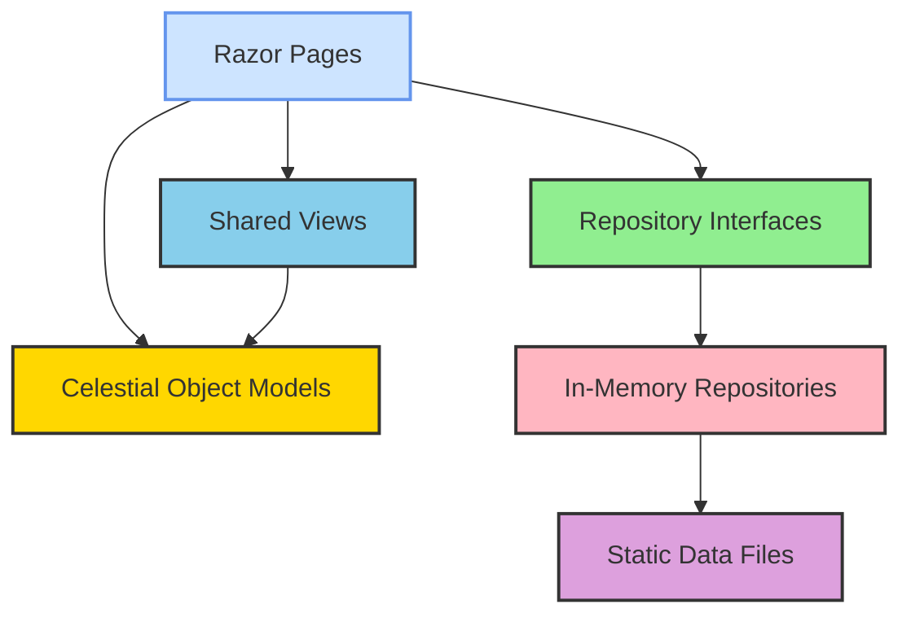
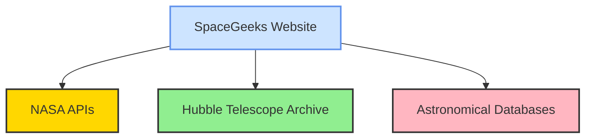
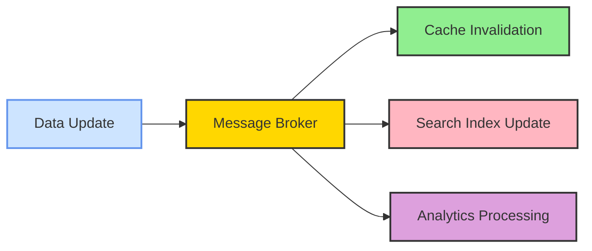
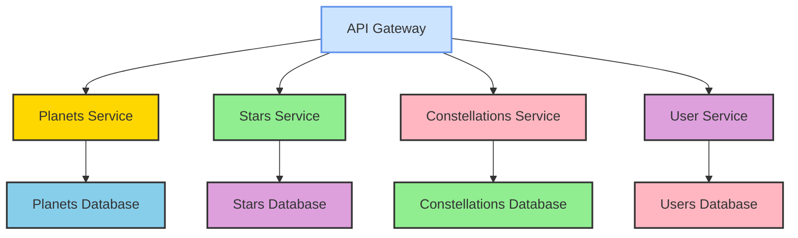

# Integration Architecture

## Overview

This document describes the integration architecture for the SpaceGeeks website, focusing on how different components interact internally and potential external integrations for enhanced functionality.

## Internal Component Integration

### Component Interaction Diagram



### Dependency Injection Flow

The ASP.NET Core dependency injection container orchestrates component integration:

1. **Service Registration** (Program.cs):
   ```csharp
   builder.Services.AddSingleton<IPlanetRepository, InMemoryPlanetRepository>();
   builder.Services.AddSingleton<IStarRepository, InMemoryStarRepository>();
   builder.Services.AddSingleton<IConstellationRepository, InMemoryConstellationRepository>();
   ```

2. **Service Resolution** (Page Models):
   ```csharp
   public class StarsModel : PageModel
   {
       private readonly IStarRepository _starRepository;
       
       public StarsModel(IStarRepository starRepository)
       {
           _starRepository = starRepository;
       }
   }
   ```

3. **Runtime Behavior**:
   - Singleton instances created at application startup
   - Repositories load data from static files once
   - Page models receive repository instances via constructor injection

### Data Flow Patterns

#### Read Operations
1. User requests a page (e.g., /Stars)
2. Routing maps to StarsModel page handler
3. Page model constructor receives IStarRepository via DI
4. OnGet() method calls `_starRepository.GetAll()`
5. Repository returns immutable Star records
6. Page model assigns data to view properties
7. Razor view renders HTML using model data
8. Response sent to user's browser

#### Shared Component Integration
- **Layout Pages**: Provide consistent site structure
- **Partial Views**: Reusable UI components (_CelestialObjectCard)
- **View Components**: Dynamic UI elements (future search functionality)
- **Tag Helpers**: Enhanced HTML generation

## External Integration Points

### Current State (No External Integrations)
- **Self-Contained**: All data included in deployment package
- **No APIs**: No calls to external services
- **Static Assets**: All images and resources local
- **No Authentication**: No external identity providers

### Potential Future Integrations

#### Educational Content Enhancement


#### Integration Patterns

##### REST API Consumption
- **Adapter Pattern**: Wrap external APIs in repository interfaces
- **Caching Layer**: Cache external data to reduce API calls
- **Fallback Mechanism**: Graceful degradation when APIs unavailable
- **Rate Limiting**: Respect external API usage limits

##### Data Import/Export
- **ETL Processes**: Extract, transform, load for data synchronization
- **File Formats**: Support for CSV, JSON, XML data exchange
- **Batch Processing**: Scheduled imports for large datasets
- **Validation**: Ensure data quality from external sources

## API Design (Future Consideration)

### Internal API Structure
If exposing programmatic access to celestial data:

#### RESTful Endpoints
```
GET /api/planets                  # List all planets
GET /api/planets/{name}           # Get specific planet
GET /api/stars                    # List all stars
GET /api/stars/{name}             # Get specific star
GET /api/constellations           # List all constellations
GET /api/constellations/{name}    # Get specific constellation
```

#### Response Format
```json
{
  "name": "Sirius",
  "spectralClass": "A1V",
  "apparentMagnitude": -1.46,
  "absoluteMagnitude": 1.42,
  "distanceLightYears": 8.66,
  "massSolarMasses": 2.02,
  "temperatureKelvin": 9940,
  "imagePath": "/images/stars/sirius.webp"
}
```

### GraphQL Alternative
For more flexible data querying:
```graphql
query {
  star(name: "Sirius") {
    name
    spectralClass
    apparentMagnitude
    distanceLightYears
    constellation {
      name
      brightestStar
    }
  }
}
```

## Third-Party Library Integration

### Current Dependencies
- **ASP.NET Core**: Web framework
- **HtmlAgilityPack**: Testing utilities (in test project)

### Integration Guidelines
1. **Minimal Dependencies**: Only include necessary libraries
2. **Version Pinning**: Lock versions to prevent unexpected changes
3. **Security Scanning**: Regular vulnerability assessments
4. **License Compliance**: Verify permissive licensing

### Wrapper Pattern
For external libraries:
```csharp
// Instead of direct usage
public class HtmlParserWrapper : IHtmlParser
{
    public IEnumerable<CelestialObject> ParseObjects(string html)
    {
        // Implementation using HtmlAgilityPack
    }
}
```

## Event-Driven Integration (Future)

### Message Patterns


### Event Types
- **DataUpdated**: Celestial object information changed
- **UserViewed**: User accessed specific content
- **SearchPerformed**: User searched for celestial objects
- **ContentAdded**: New celestial objects added

## Microservices Integration (Long-term)

### Decomposition Strategy
If evolving to microservices architecture:



### Communication Patterns
- **Synchronous**: REST APIs for immediate responses
- **Asynchronous**: Message queues for background processing
- **Event Sourcing**: Audit trail of all data changes
- **CQRS**: Separate read/write models for scalability

## Data Integration

### File-Based Integration
Current approach using static JSON files:
- **Schema Validation**: Ensure data structure consistency
- **Automated Testing**: Verify data integrity
- **Version Control**: Track changes to data files
- **Deployment**: Data packaged with application

### Database Integration (Future)
Potential evolution to database storage:
- **ORM Integration**: Entity Framework Core
- **Migration Strategy**: Gradual transition from files to DB
- **Backup Procedures**: Regular data backup processes
- **Performance Tuning**: Indexing and query optimization

## Testing Integration

### Unit Testing
- **Mock Repositories**: Isolated testing of page models
- **Stub Services**: Simulate external dependencies
- **Contract Verification**: Ensure interface compliance

### Integration Testing
- **In-Memory Databases**: Test with realistic data scenarios
- **API Mocking**: Simulate external service responses
- **End-to-End Flows**: Verify complete user journeys

### Continuous Integration
- **Automated Builds**: Compile and test on every commit
- **Quality Gates**: Prevent deployment of failing code
- **Security Scans**: Automated vulnerability detection
- **Performance Tests**: Monitor response times and throughput

## Monitoring and Observability Integration

### Logging Integration
- **Structured Logging**: Consistent log format for analysis
- **Correlation IDs**: Trace requests across components
- **Context Enrichment**: Add relevant metadata to logs

### Metrics Integration
- **Performance Counters**: Track response times and throughput
- **Business Metrics**: Monitor user engagement and content popularity
- **Health Checks**: Verify component availability

### Tracing Integration
- **Distributed Tracing**: Track requests across services
- **Span Instrumentation**: Measure component performance
- **Error Tracking**: Capture and analyze exceptions

## Conclusion

The SpaceGeeks website currently has a simple but effective integration architecture focused on internal component collaboration. The design allows for future enhancements with external integrations while maintaining the simplicity that makes it suitable for educational purposes. All integration points are designed with scalability, maintainability, and security in mind.