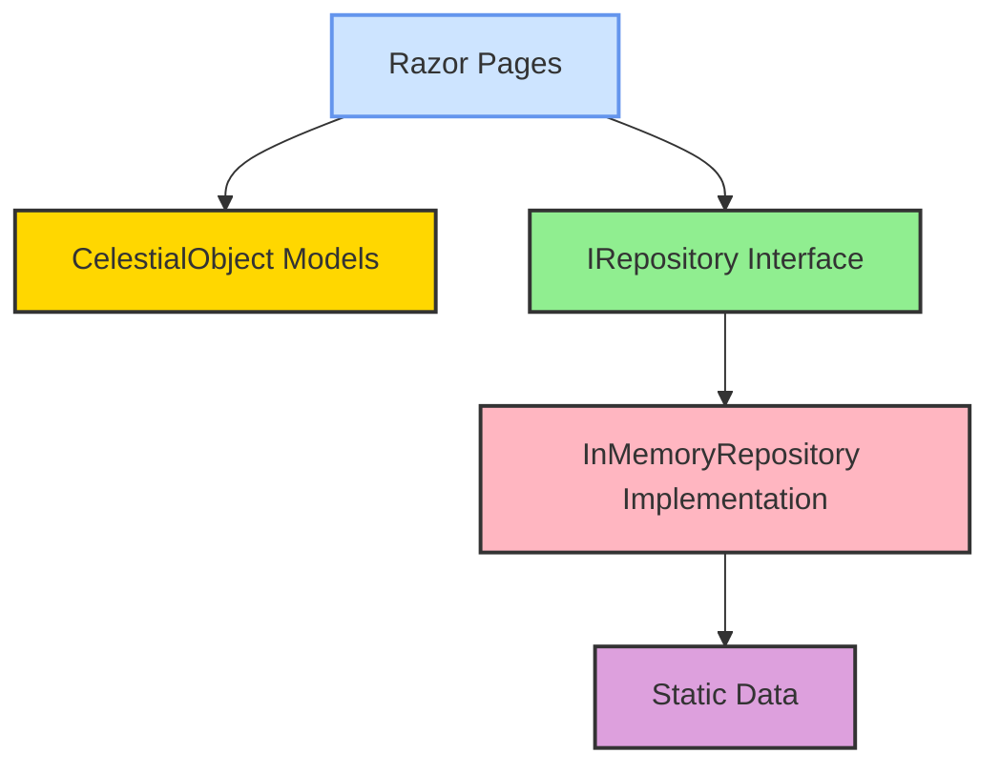

# Logical Architecture

## Overview

This document describes the logical architecture of the SpaceGeeks website, detailing the structure of the codebase and the relationships between components.

## High-Level Structure



## Layered Architecture

The SpaceGeeks website follows a layered architecture pattern with clear separation of concerns:

### Presentation Layer
- **Technology**: ASP.NET Core Razor Pages
- **Components**:
  - Page models (IndexModel, StarModel, ConstellationModel, etc.)
  - Razor views (.cshtml files)
  - Shared components (_Layout.cshtml, _CelestialObjectCard.cshtml, etc.)
- **Responsibilities**:
  - Handle HTTP requests and responses
  - Render UI components
  - Bind user input to model data

### Domain Layer
- **Components**:
  - Celestial object models (Planet, Star, Constellation)
  - Value objects and enums
- **Responsibilities**:
  - Represent domain concepts
  - Enforce business rules and invariants
  - Provide immutable data structures

### Data Access Layer
- **Pattern**: Repository pattern
- **Components**:
  - IRepository interfaces (IPlanetRepository, IStarRepository, IConstellationRepository)
  - In-memory implementations (InMemoryPlanetRepository, InMemoryStarRepository, InMemoryConstellationRepository)
- **Responsibilities**:
  - Abstract data access mechanisms
  - Provide consistent interface for data operations
  - Encapsulate data storage details

### Infrastructure Layer
- **Components**:
  - Static data files
  - Dependency injection configuration
- **Responsibilities**:
  - Provide concrete implementations of abstractions
  - Configure application services
  - Manage application lifecycle

## Component Details

### Celestial Object Models

#### Planet
- Already implemented in the current codebase
- Properties: Name, DiameterKm, MassKg, DistanceFromSunKm, NumberOfMoons, OrbitalPeriodDays, ImagePath

#### Star (New)
- Properties: Name, SpectralClass, ApparentMagnitude, AbsoluteMagnitude, DistanceLightYears, MassSolarMasses, TemperatureKelvin, ImagePath

#### Constellation (New)
- Properties: Name, Abbreviation, Genitive, Family, Origin, Meaning, BrightestStar, ImagePath

### Repository Pattern

The repository pattern provides a clean abstraction for data access:

```csharp
public interface ICelestialObjectRepository<T>
{
    IReadOnlyList<T> GetAll();
    T GetByName(string name);
}
```

Each celestial object type will have its dedicated repository interface and implementation.

### Dependency Injection

Services are registered in `Program.cs` using the built-in ASP.NET Core DI container:

```csharp
builder.Services.AddSingleton<IPlanetRepository, InMemoryPlanetRepository>();
builder.Services.AddSingleton<IStarRepository, InMemoryStarRepository>();
builder.Services.AddSingleton<IConstellationRepository, InMemoryConstellationRepository>();
```

## Data Flow

1. Application startup:
   - Repositories are instantiated and populated with data from static files
   - Services are registered with the DI container

2. User request:
   - HTTP request routed to appropriate Razor Page
   - Page model constructor receives required repositories via DI
   - Page model calls repository methods to retrieve data
   - Page model prepares view model data
   - Razor view renders HTML response

3. Data retrieval:
   - Repositories return immutable records
   - Data is sorted/filtered as needed
   - No external data sources during runtime

## Extensibility Points

The architecture supports easy extension through:

1. **New celestial object types**: Add new models, repositories, and pages
2. **Additional data sources**: Replace in-memory repositories with database implementations
3. **Enhanced presentation**: Add new Razor components and styling
4. **Advanced features**: Integrate search, filtering, and sorting capabilities

## Design Principles

1. **Immutability**: All domain models are implemented as immutable records
2. **Single Responsibility**: Each component has a clear, focused purpose
3. **Dependency Inversion**: High-level modules depend on abstractions, not implementations
4. **Open/Closed Principle**: Components are open for extension but closed for modification
5. **Interface Segregation**: Fine-grained interfaces tailored to specific clients