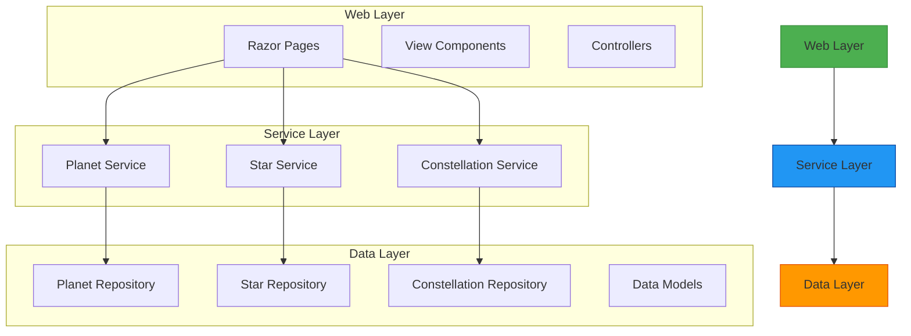

# Logical Architecture

## Overview

The logical architecture describes the structural decomposition of the SpaceGeeks website, showing the key components, their responsibilities, and relationships. The architecture follows a layered approach with clear separation of concerns.

## Component Diagram



## Layers

### Web Layer

Responsible for handling user interactions and presenting information:

1. **Razor Pages**
   - Index page for each celestial object category
   - Detail pages for individual objects
   - Search and filtering pages

2. **View Components**
   - Reusable UI components for displaying celestial objects
   - Navigation elements
   - Shared layout components

3. **Controllers** (if needed for API endpoints)

### Service Layer

Contains business logic and coordination between web and data layers:

1. **Planet Service**
   - Coordinates retrieval of planet data
   - Implements any planet-specific business rules

2. **Star Service**
   - Manages star data retrieval
   - Implements star-related business logic
   - Coordinates with constellation service for related data

3. **Constellation Service**
   - Handles constellation data operations
   - Manages relationships between constellations and stars
   - Implements constellation-specific functionality

### Data Layer

Responsible for data persistence and retrieval:

1. **Planet Repository**
   - Current in-memory implementation for planets
   - Interface-based design for future extensibility

2. **Star Repository**
   - New component for star data management
   - Will follow same pattern as planet repository

3. **Constellation Repository**
   - New component for constellation data management
   - Will manage relationships to stars

4. **Data Models**
   - Strongly-typed representations of domain entities
   - Immutable records for data integrity

## Data Models

### Star Model

```csharp
public sealed record Star(
    string Name,
    string Constellation,
    double ApparentMagnitude,
    double AbsoluteMagnitude,
    double DistanceLightYears,
    double TemperatureKelvin,
    string SpectralClass,
    string ImagePath
);
```

### Constellation Model

```csharp
public sealed record Constellation(
    string Name,
    string Hemisphere,
    int NumberOfVisibleStars,
    string Description,
    string ImagePath,
    IReadOnlyList<string> NotableStars
);
```

## Cross-Cutting Concerns

### Logging
- Structured logging throughout all layers
- Error tracking and monitoring

### Configuration
- Environment-specific settings
- Feature flags for gradual rollout

### Security
- Input validation and sanitization
- Protection against common web vulnerabilities

### Caching
- Potential caching strategies for improved performance
- Cache invalidation policies

## Design Patterns

1. **Repository Pattern**
   - Abstracts data access mechanisms
   - Enables testability and flexibility

2. **Dependency Injection**
   - Used throughout the application for loose coupling
   - Managed by ASP.NET Core DI container

3. **Separation of Concerns**
   - Clear boundaries between layers
   - Single responsibility principle applied to components

4. **Immutability**
   - Data models implemented as immutable records
   - Thread-safe and predictable behavior