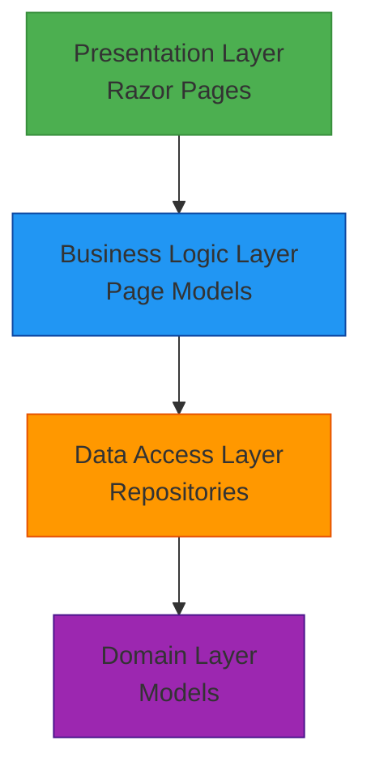
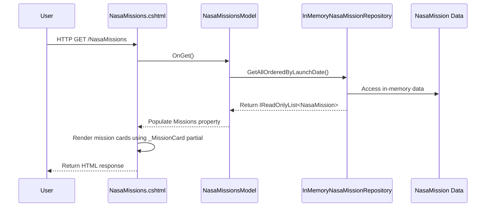

# Logical Architecture

## 1. Overview

This document describes the logical architecture of the SpaceGeeks website, detailing the components, their responsibilities, and interactions within the application.

## 2. Layered Architecture

The SpaceGeeks application follows a traditional layered architecture pattern with clear separation of concerns:

## 3. Component Details

### 3.1 Presentation Layer

#### Razor Pages
Responsible for rendering the user interface and handling user interactions.

**Components:**
- `Index.cshtml` - Home page showing featured planets
- `NasaMissions.cshtml` - Page displaying NASA missions
- `Privacy.cshtml` - Privacy policy page
- `Error.cshtml` - Error handling page

**Shared Components:**
- `_Layout.cshtml` - Master layout template
- `_PlanetCard.cshtml` - Reusable planet display component
- `_MissionCard.cshtml` - Reusable NASA mission display component

**Responsibilities:**
- Rendering HTML content
- Handling GET/POST requests
- Delegating to page models for business logic

### 3.2 Business Logic Layer

#### Page Models
Handle request processing and coordinate between presentation and data layers.

**Components:**
- `IndexModel` - Processes home page requests
- `NasaMissionsModel` - Processes NASA missions page requests
- `PrivacyModel` - Processes privacy page requests
- `ErrorModel` - Handles error scenarios

**Responsibilities:**
- Processing HTTP requests
- Coordinating data retrieval from repositories
- Preparing data for presentation
- Handling business rules and validation

### 3.3 Data Access Layer

#### Repositories
Provide access to domain data through well-defined interfaces.

**Interfaces:**
- `IPlanetRepository` - Contract for planet data access
- `INasaMissionRepository` - Contract for NASA mission data access

**Implementations:**
- `InMemoryPlanetRepository` - In-memory implementation for planet data
- `InMemoryNasaMissionRepository` - In-memory implementation for NASA mission data

**Responsibilities:**
- Abstracting data storage implementation details
- Providing consistent data access patterns
- Ensuring data integrity and immutability

### 3.4 Domain Layer

#### Models
Represent core business entities as immutable records.

**Components:**
- `Planet` - Represents a planet in our solar system
- `NasaMission` - Represents a NASA space mission

**Characteristics:**
- Immutable by design (using C# records)
- Contain only data and no behavior
- Validated at construction time
- Thread-safe due to immutability

## 4. Data Flow

### 4.1 NASA Missions Page Request Flow

## 5. Design Patterns

### 5.1 Repository Pattern
Used to abstract data access and provide a consistent interface for retrieving domain entities.

**Benefits:**
- Decouples presentation layer from data storage implementation
- Enables easy testing through mocking
- Provides a clean separation of concerns

### 5.2 Dependency Injection
Used throughout the application to manage component dependencies.

**Implementation:**
- Services registered in `Program.cs`
- Injected into page models through constructors
- Enables loose coupling and testability

### 5.3 Immutable Records
Domain models use C# records to ensure immutability.

**Benefits:**
- Thread-safe by design
- Predictable behavior
- Simplified reasoning about data
- Automatic equality implementation

## 6. Architectural Decisions

### 6.1 In-Memory Data Storage
**Decision**: Use in-memory collections instead of external databases.
**Rationale**: 
- Simplifies deployment and development setup
- Appropriate for small, static datasets
- Reduces operational complexity
- Sufficient for educational website requirements

### 6.2 Razor Pages Architecture
**Decision**: Use Razor Pages instead of MVC or SPA frameworks.
**Rationale**:
- Simpler architecture for static content
- Better performance for content-focused sites
- Easier to maintain and deploy
- Appropriate for educational website requirements