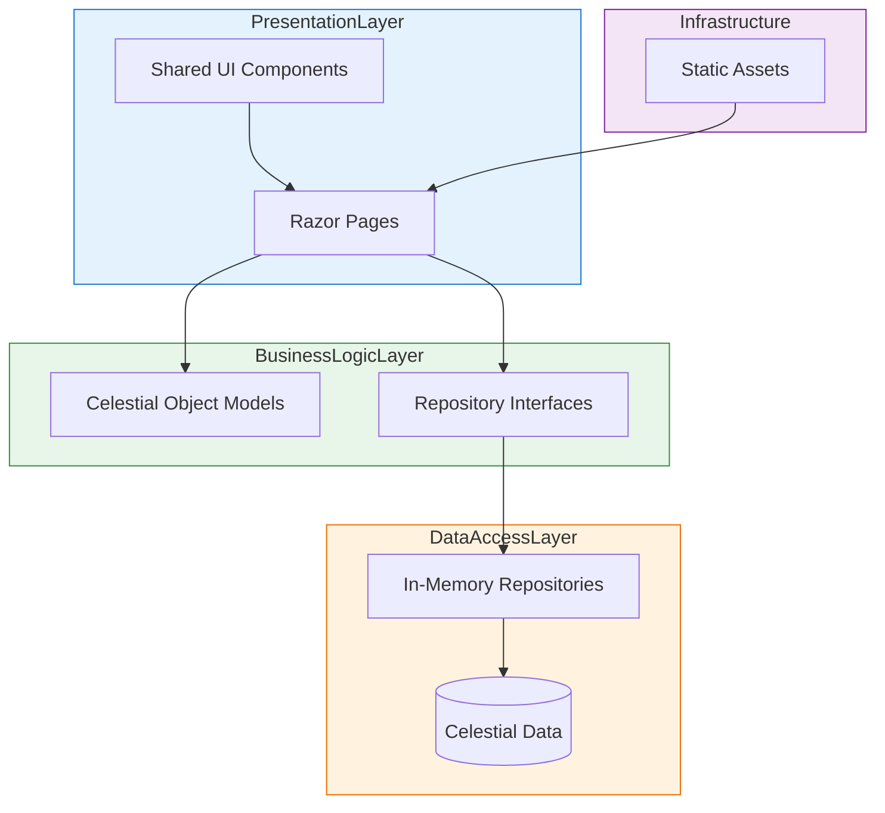

# Logical Architecture

## Component Diagram

## Component Descriptions

### Presentation Layer

#### Razor Pages
The presentation layer consists of ASP.NET Core Razor Pages that handle user requests and render HTML responses. Key pages include:
- `Index.cshtml` - Main landing page
- `Stars/Index.cshtml` - Browse stars page (to be implemented)
- `Constellations/Index.cshtml` - Browse constellations page (to be implemented)
- `Stars/Details.cshtml` - Individual star details page (to be implemented)
- `Constellations/Details.cshtml` - Individual constellation details page (to be implemented)

#### Shared UI Components
Reusable UI components that can be included in multiple pages:
- `_CelestialObjectCard.cshtml` - Displays summary information for a celestial object
- `_NavigationMenu.cshtml` - Site navigation component
- `_SearchForm.cshtml` - Search and filtering controls

### Business Logic Layer

#### Celestial Object Models
Immutable data models representing different types of celestial objects:

1. **Planet** - Represents a planet in our solar system (already implemented)
2. **Star** - Represents a star with properties such as:
   - Name
   - Right Ascension
   - Declination
   - Apparent Magnitude
   - Absolute Magnitude
   - Distance (light years)
   - Spectral Class
   - Mass (solar masses)
   - Radius (solar radii)
   - Temperature (Kelvin)
   - Image Path

3. **Constellation** - Represents a constellation with properties such as:
   - Name
   - Abbreviation
   - Genitive
   - Description
   - Quadrant
   - Brightest Stars
   - Image Path

#### Repository Interfaces
Abstraction layer defining contracts for data access:
- `IPlanetRepository` - Already implemented for planets
- `IStarRepository` - New interface for star data access
- `IConstellationRepository` - New interface for constellation data access

### Data Access Layer

#### In-Memory Repositories
Implementation of repository interfaces using in-memory collections:
- `InMemoryPlanetRepository` - Already implemented
- `InMemoryStarRepository` - To be implemented
- `InMemoryConstellationRepository` - To be implemented

#### Celestial Data
Static collections containing the actual data about celestial objects.

### Infrastructure

#### Static Assets
Images, CSS stylesheets, and JavaScript files served as static content.

## Data Flow

1. User requests a page through their browser
2. ASP.NET Core routing directs the request to the appropriate Razor Page
3. The page handler accesses required data through repository interfaces
4. Repositories retrieve data from in-memory collections
5. The page renders HTML using Razor syntax and shared components
6. Browser receives HTML, CSS, and JavaScript and renders the page
7. Additional assets (images) are loaded as needed

## Design Patterns

### Repository Pattern
Used to abstract data access logic and provide a clean separation between business logic and data storage.

### Dependency Injection
ASP.NET Core's built-in DI container is used to inject repository implementations into page handlers.

### Immutable Records
Celestial object models are implemented as immutable records to ensure data integrity and thread safety.

## Extension Points

The architecture is designed to allow easy extension:
1. Replace in-memory repositories with database-backed implementations
2. Add new celestial object types (galaxies, nebulae, etc.)
3. Extend existing models with additional properties
4. Add API endpoints alongside existing Razor Pages