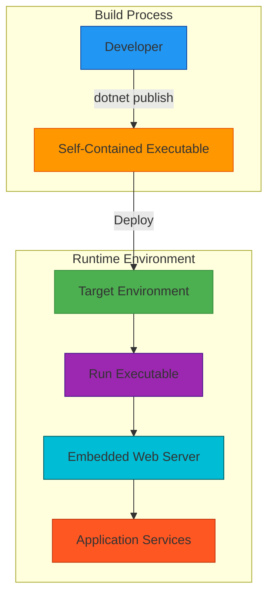

# Deployment Architecture: Mars Rover Missions Extension

## 1. Overview

This document describes the deployment architecture for the Mars Rover Missions extension to the SpaceGeeks website. The extension maintains the existing deployment approach with no additional infrastructure requirements.

## 2. Deployment Model

The Mars Rover Missions extension follows the same deployment model as the existing SpaceGeeks application:

## 3. Deployment Components

### 3.1 Build Process (Unchanged)

The build process remains identical to the existing application:

1. **Source Code**: C# source files including extended `InMemoryNasaMissionRepository.cs`
2. **Build Tool**: .NET CLI (`dotnet publish`)
3. **Output**: Self-contained executable with embedded runtime

### 3.2 Runtime Environment (Unchanged)

The runtime environment requirements remain unchanged:

- **Operating System**: Cross-platform support (Windows, Linux, macOS)
- **Dependencies**: None (self-contained deployment)
- **Resources**: Minimal CPU and memory footprint
- **Ports**: Single port for HTTP communication (configurable)

### 3.3 Deployment Targets (Unchanged)

The extension can be deployed to the same targets as the existing application:

- **Local Development**: Developer workstations for testing
- **Production Servers**: Dedicated hosting environments
- **Cloud Platforms**: Azure App Service, AWS Elastic Beanstalk, Google Cloud Run
- **Container Environments**: Docker containers with self-contained executables

## 4. Configuration Management

The Mars Rover Missions extension requires no additional configuration beyond the existing application:

### 4.1 Environment Variables (Unchanged)
- `ASPNETCORE_URLS`: Configures the listening address and port
- Other existing environment variables remain applicable

### 4.2 Configuration Files (Unchanged)
- `appsettings.json`: Base configuration settings
- `appsettings.Development.json`: Development-specific settings
- No new configuration files required for Mars missions

### 4.3 Data Configuration
- All Mars rover mission data is embedded in the `InMemoryNasaMissionRepository`
- No external data sources or connections required
- No runtime configuration of mission data

## 5. Scaling Considerations

The deployment architecture for the Mars Rover Missions extension maintains the same scaling characteristics as the base application:

### 5.1 Vertical Scaling
- **CPU**: Minimal processing requirements for serving static mission data
- **Memory**: Small memory footprint with in-memory data store
- **Storage**: Negligible disk space requirements for additional mission data

### 5.2 Horizontal Scaling
- **Stateless Operation**: Application remains stateless, enabling horizontal scaling
- **Load Balancing**: Multiple instances can be load balanced without session affinity
- **Data Consistency**: All instances contain identical mission data through compiled binaries

### 5.3 Performance Impact
- **Startup Time**: Negligible increase due to additional mission data
- **Memory Usage**: Minimal increase in memory footprint
- **Response Time**: No impact on response times for existing functionality

## 6. Monitoring and Observability (Unchanged)

The extension maintains the existing monitoring capabilities:

### 6.1 Health Checks
- Built-in ASP.NET Core health check endpoints
- No additional health checks required for Mars mission data

### 6.2 Logging
- Standard application logging through .NET logging infrastructure
- No special logging for Mars mission data access

### 6.3 Metrics
- Existing performance metrics remain applicable
- No additional metrics specific to Mars missions

## 7. Backup and Recovery (Unchanged)

The deployment architecture maintains the same backup and recovery characteristics:

### 7.1 Data Persistence
- Mission data is part of the application binary
- No external data stores requiring backup

### 7.2 Recovery Process
- Standard application redeployment procedures
- No special recovery steps for Mars mission data

## 8. Security Considerations (Unchanged)

The extension maintains the existing security posture:

### 8.1 Attack Surface
- No increase in attack surface from additional mission data
- Same security boundaries as existing application

### 8.2 Data Protection
- Mission data is read-only and compiled into the application
- No user input processing for mission data

## 9. Rollback Strategy

Rollback procedures remain unchanged:
- Replace deployed executable with previous version
- No external data migrations or cleanup required
- Atomic deployment ensures consistent state