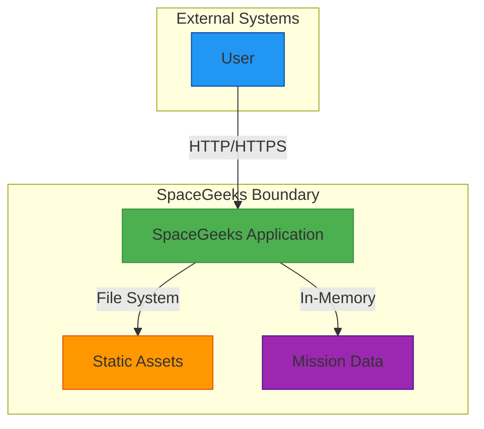

# Integration Architecture: Mars Rover Missions Extension

## 1. Overview

This document describes the integration architecture for the Mars Rover Missions extension to the SpaceGeeks website. The extension maintains the existing integration characteristics with no external system dependencies.

## 2. Integration Model

The Mars Rover Missions extension follows the same integration model as the existing application, which has no external integrations:



## 3. Internal Integrations

### 3.1 ASP.NET Core Framework (Unchanged)
The extension integrates with the same ASP.NET Core components as the existing application:

- **Hosting Model**: Kestrel web server for HTTP request processing
- **Routing**: Convention-based routing for Razor Pages
- **Middleware Pipeline**: Standard middleware for security, static files, and error handling
- **Dependency Injection**: Built-in DI container for service resolution

### 3.2 Razor View Engine (Unchanged)
Integration with the Razor view engine remains unchanged:

- **View Compilation**: Runtime compilation in development, precompilation in production
- **Partial Views**: Shared components for consistent UI rendering
- **HTML Helpers**: Built-in helpers for form generation and URL creation

### 3.3 Configuration System (Unchanged)
The extension uses the existing .NET configuration system:

- **JSON Configuration**: appsettings.json files for environment-specific settings
- **Environment Variables**: Runtime configuration through environment variables
- **Command Line**: Startup configuration through command-line arguments

## 4. External Integrations

### 4.1 No External API Dependencies
The Mars Rover Missions extension maintains the existing characteristic of having no external API dependencies:

- **No NASA APIs**: Mission data is statically compiled rather than fetched dynamically
- **No Third-Party Services**: No integration with external content providers
- **No Real-Time Data**: All data is static educational content

### 4.2 No Database Connections
The extension continues the pattern of avoiding external database dependencies:

- **In-Memory Storage**: All mission data stored in application memory
- **No SQL Connections**: No relational database integration
- **No NoSQL Clients**: No document database connections

### 4.3 No Message Queues
The extension does not introduce asynchronous messaging patterns:

- **No Event Bus**: No pub/sub messaging infrastructure
- **No Queue Processing**: No background job processing
- **Synchronous Operations**: All operations complete within HTTP request lifecycle

## 5. Data Integration

### 5.1 Mission Data Structure
The extension integrates with the existing `NasaMission` domain model:

```csharp
public sealed record NasaMission(
    string Name,
    string Description,
    DateTime LaunchDate,
    DateTime? EndDate,
    string Status,
    string ImagePath
);
```

### 5.2 Repository Integration
The extension integrates with the existing repository pattern:

- **Interface Compatibility**: Uses existing `INasaMissionRepository` interface
- **Implementation Extension**: Extends `InMemoryNasaMissionRepository` with Mars missions
- **Method Consistency**: Maintains all existing method signatures

### 5.3 Data Consistency
The extension maintains consistency with existing data integration patterns:

- **Immutability**: All mission data remains immutable
- **Type Safety**: Strong typing enforced through C# records
- **Validation**: Data validation at compile time through constructor parameters

## 6. UI Integration

### 6.1 Page Model Integration
The extension integrates with existing page models without modification:

- **NasaMissionsModel**: Continues to serve all missions including Mars rovers
- **Dependency Injection**: Same constructor injection pattern for repository access
- **Data Preparation**: Existing data preparation logic unchanged

### 6.2 Component Integration
The extension integrates with existing UI components:

- **_MissionCard Partial**: Renders Mars missions using existing component
- **Layout Templates**: Uses existing master layout without changes
- **CSS Framework**: Bootstrap components used consistently

### 6.3 Navigation Integration
The extension integrates with existing navigation patterns:

- **Main Menu**: Mars missions accessible through existing NASA Missions link
- **Breadcrumbs**: Existing breadcrumb navigation preserved
- **Footer Links**: No changes to global site navigation

## 7. Testing Integration

### 7.1 Unit Test Integration
The extension integrates with existing unit testing approaches:

- **xUnit Framework**: Same testing framework as existing tests
- **Mocking Patterns**: Existing repository mocking strategies applicable
- **Test Coverage**: New mission data covered by existing test patterns

### 7.2 Integration Test Integration
The extension works with existing integration testing infrastructure:

- **WebApplicationFactory**: Existing test server infrastructure reusable
- **HTTP Client Testing**: Same approach for testing page responses
- **HTML Parsing**: HtmlAgilityPack usage patterns unchanged

## 8. Build and Deployment Integration

### 8.1 Build Process Integration
The extension integrates with existing build processes:

- **MSBuild**: Standard .NET build process unchanged
- **NuGet Restore**: No additional package dependencies
- **Assembly Compilation**: Mars mission data compiled into main assembly

### 8.2 CI/CD Integration
The extension integrates with existing continuous integration pipelines:

- **GitHub Actions**: Existing workflows cover extension code
- **Automated Testing**: Same test suite executed for extension
- **Deployment Pipelines**: No changes to deployment automation

### 8.3 Container Integration
The extension integrates with existing containerization approaches:

- **Docker**: Same Dockerfile works for extended application
- **Multi-stage Builds**: Existing optimization strategies unchanged
- **Runtime Images**: No additional runtime dependencies

## 9. Monitoring Integration

### 9.1 Logging Integration
The extension integrates with existing logging infrastructure:

- **ILogger Interface**: Same logging abstractions used
- **Log Levels**: Consistent log level usage
- **Structured Logging**: Existing structured logging patterns maintained

### 9.2 Metrics Integration
The extension works with existing metrics collection:

- **Built-in Metrics**: ASP.NET Core metrics cover extended functionality
- **Custom Counters**: No additional custom metrics required
- **Performance Monitoring**: Existing APM tools monitor extended pages

## 10. Security Integration

### 10.1 Authentication Integration
The extension maintains existing authentication characteristics:

- **Anonymous Access**: No authentication changes required
- **Authorization Policies**: Existing policies remain effective
- **Claims Integration**: No claims-based access control needed

### 10.2 Security Middleware Integration
The extension works with existing security middleware:

- **HTTPS Enforcement**: Same redirect rules apply
- **Security Headers**: Existing header configuration unchanged
- **CORS Policy**: No cross-origin resource sharing changes