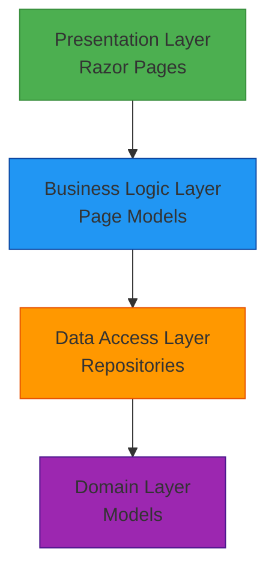
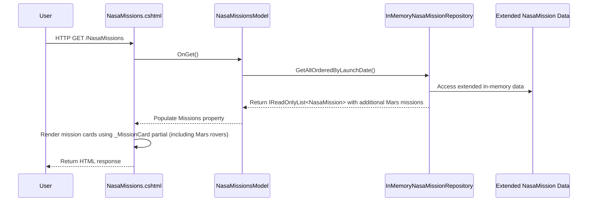

# Logical Architecture: Mars Rover Missions Extension

## 1. Overview

This document describes the logical architecture for the Mars Rover Missions extension to the SpaceGeeks website, detailing the components, their responsibilities, and interactions within the application.

## 2. Layered Architecture

The Mars Rover Missions extension maintains the traditional layered architecture pattern with clear separation of concerns established in the existing application:

## 3. Component Details

### 3.1 Presentation Layer (Unchanged)

#### Razor Pages
Responsible for rendering the user interface and handling user interactions.

**Components:**
- `NasaMissions.cshtml` - Page displaying NASA missions (unchanged, will show additional Mars missions)
- Other existing pages remain unchanged

**Shared Components:**
- `_MissionCard.cshtml` - Reusable NASA mission display component (unchanged)
- Other existing components remain unchanged

**Responsibilities:**
- Rendering HTML content (unchanged)
- Handling GET/POST requests (unchanged)
- Delegating to page models for business logic (unchanged)

### 3.2 Business Logic Layer (Unchanged)

#### Page Models
Handle request processing and coordinate between presentation and data layers.

**Components:**
- `NasaMissionsModel` - Processes NASA missions page requests (unchanged)
- Other existing page models remain unchanged

**Responsibilities:**
- Processing HTTP requests (unchanged)
- Coordinating data retrieval from repositories (unchanged)
- Preparing data for presentation (unchanged)
- Handling business rules and validation (unchanged)

### 3.3 Data Access Layer (Enhanced)

#### Repositories
Provide access to domain data through well-defined interfaces.

**Interfaces:**
- `INasaMissionRepository` - Contract for NASA mission data access (unchanged)

**Implementations:**
- `InMemoryNasaMissionRepository` - Enhanced in-memory implementation for NASA mission data with additional Mars rover missions

**Changes Made:**
- Extended the existing `_missions` collection with additional Mars rover missions
- Maintained all existing functionality and data
- Preserved the same interface and method signatures

**Responsibilities:**
- Abstracting data storage implementation details (unchanged)
- Providing consistent data access patterns (unchanged)
- Ensuring data integrity and immutability (unchanged)
- Serving extended dataset with Mars rover missions

### 3.4 Domain Layer (Unchanged)

#### Models
Represent core business entities as immutable records.

**Components:**
- `NasaMission` - Represents a NASA space mission (unchanged, reused for Mars rover missions)

**Characteristics:**
- Immutable by design (using C# records) (unchanged)
- Contain only data and no behavior (unchanged)
- Validated at construction time (unchanged)
- Thread-safe due to immutability (unchanged)

## 4. Data Flow

### 4.1 NASA Missions Page Request Flow (Enhanced)

## 5. Design Patterns (Unchanged)

### 5.1 Repository Pattern
Continues to be used to abstract data access and provide a consistent interface for retrieving domain entities.

**Benefits:**
- Decouples presentation layer from data storage implementation (unchanged)
- Enables easy testing through mocking (unchanged)
- Provides a clean separation of concerns (unchanged)

### 5.2 Dependency Injection
Continues to be used throughout the application to manage component dependencies.

**Implementation:**
- Services registered in `Program.cs` (unchanged)
- Injected into page models through constructors (unchanged)
- Enables loose coupling and testability (unchanged)

### 5.3 Immutable Records
Domain models continue to use C# records to ensure immutability.

**Benefits:**
- Thread-safe by design (unchanged)
- Predictable behavior (unchanged)
- Simplified reasoning about data (unchanged)
- Automatic equality implementation (unchanged)

## 6. Architectural Decisions

### 6.1 Data Extension Approach
**Decision**: Extend existing in-memory data rather than creating separate Mars mission storage.
**Rationale**: 
- Maintains consistency with existing data management approach
- Leverages proven patterns and reduces complexity
- Avoids unnecessary architectural changes
- Simplifies maintenance and future enhancements

### 6.2 Reuse of Existing Model
**Decision**: Use existing `NasaMission` model for Mars rover missions.
**Rationale**:
- Mars rover missions are NASA missions, fitting the existing domain model
- Eliminates need for new data structures
- Maintains UI consistency through existing components
- Reduces development effort and potential bugs

### 6.3 Chronological Ordering
**Decision**: Include Mars rover missions in chronological order with other NASA missions.
**Rationale**:
- Provides coherent timeline of space exploration achievements
- Allows users to understand Mars exploration in historical context
- Maintains existing sorting behavior without modification