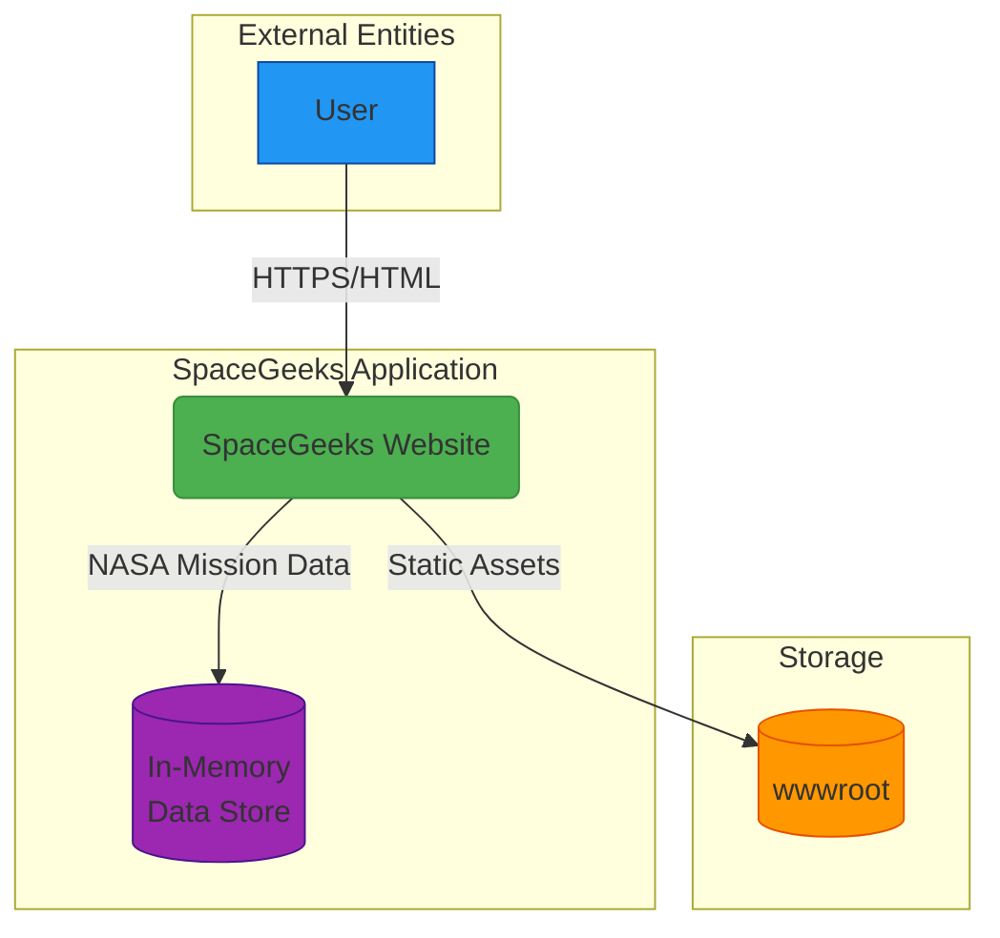

# System Context: Mars Rover Missions Extension

## 1. Overview

This document describes the system context for the Mars Rover Missions extension to the SpaceGeeks website, showing how the enhancement fits within the existing environment and interacts with external entities.

## 2. System Context Diagram

## 3. System Description

### SpaceGeeks Website
The core application remains unchanged as a self-hosted ASP.NET Core web application that serves educational content about space exploration. The Mars Rover Missions extension adds data to the existing NASA Missions feature without modifying the core application architecture.

**Key characteristics:**
- Single-process application with embedded web server (unchanged)
- No external database dependencies (uses in-memory data stores) (unchanged)
- Serves static assets (CSS, JavaScript, images) from local file system (unchanged)
- Stateless operation with no user sessions (unchanged)

### User
Represents visitors to the website who are seeking educational content about space and NASA missions, including Mars rover missions.

**Responsibilities:**
- Accessing the website through a web browser
- Navigating between different sections (planets, NASA missions)
- Viewing educational content about Mars rover missions
- Interacting with the existing UI components

### wwwroot (Static Assets)
Contains all static resources required by the website including CSS stylesheets, JavaScript files, and images.

**Characteristics:**
- Served directly by the web server (unchanged)
- No processing or transformation applied (unchanged)
- Cached aggressively by browsers (unchanged)

### In-Memory Data Store
Contains the extended dataset of NASA missions including additional Mars rover missions.

**Characteristics:**
- Embedded within the application process (unchanged)
- No external dependencies (unchanged)
- Extended with additional Mars rover mission data
- Maintains existing data access patterns (unchanged)

## 4. Trust Boundaries

The trust boundaries remain unchanged from the base application:

1. **Application Boundary**: Separates the user's browser from the SpaceGeeks application. All communication across this boundary uses HTTPS for transport security.

Within the application boundary, there are no additional trust boundaries as all components run in the same process with shared memory access.

## 5. Data Flow

### User Request Flow (Unchanged):
1. User makes HTTP request to web server
2. Server routes request to appropriate Razor Page
3. Page model processes request and retrieves data from repositories
4. Razor view renders HTML response
5. Response sent back to user's browser

### Static Asset Flow (Unchanged):
1. User requests static asset (CSS, JS, image)
2. Server serves file directly from wwwroot directory
3. File content sent back to user's browser

### Enhanced Data Flow:
1. User requests NASA Missions page
2. Page model retrieves extended dataset from `InMemoryNasaMissionRepository`
3. Repository returns all NASA missions including additional Mars rover missions
4. Page renders complete mission list using existing UI components

## 6. Integration Points

The Mars Rover Missions extension maintains the existing integration point characteristics:

The SpaceGeeks website continues to have no external integration points. All data is stored in-memory and all assets are served locally. This simplifies deployment and eliminates external dependencies but limits scalability for large datasets.