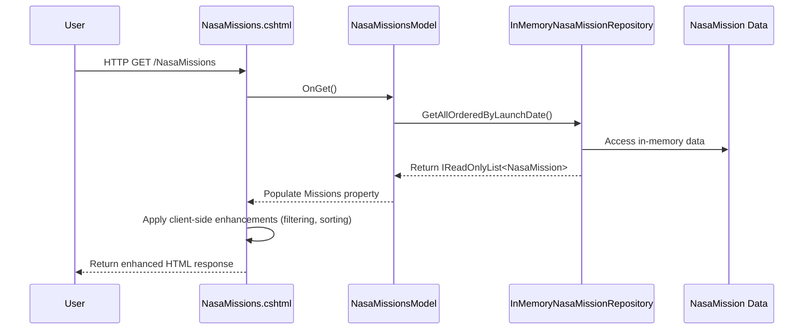

# NASA Missions Enhancement - Data Design

## Data Classification
- **Classification**: Public (educational content)
- **Storage**: In-memory collections (no change from existing approach)
- **Encryption**: None required for public educational data

## Data at Rest
- **Technology**: C# in-memory arrays
- **Encryption**: Not applicable (transient data)

## Data in Transit
- **Protocol**: HTTPS
- **Encryption**: TLS 1.2+

## Data Flow

