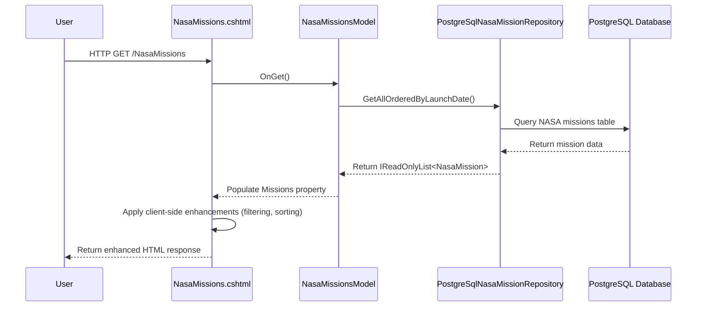

# NASA Missions Enhancement - Data Design

## Data Classification
- **Classification**: Public (educational content)
- **Storage**: PostgreSQL database
- **Encryption**: None required for public educational data

## Data at Rest
- **Technology**: PostgreSQL relational database
- **Encryption**: Database-level encryption (as configured in deployment environment)

## Data in Transit
- **Protocol**: HTTPS
- **Encryption**: TLS 1.2+

## Data Flow

```mermaid
sequenceDiagram
    participant U as User
    participant P as NasaMissions.cshtml
    participant M as NasaMissionsModel
    participant R as PostgreSqlNasaMissionRepository
    participant D as PostgreSQL Database
    
    U->>P: HTTP GET /NasaMissions
    P->>M: OnGet()
    M->>R: GetAllOrderedByLaunchDate()
    R->>D: Query NASA missions table
    D-->>R: Return mission data
    R-->>M: Return IReadOnlyList<NasaMission>
    M-->>P: Populate Missions property
    P->>P: Apply client-side enhancements (filtering, sorting)
    P-->>U: Return enhanced HTML response
```