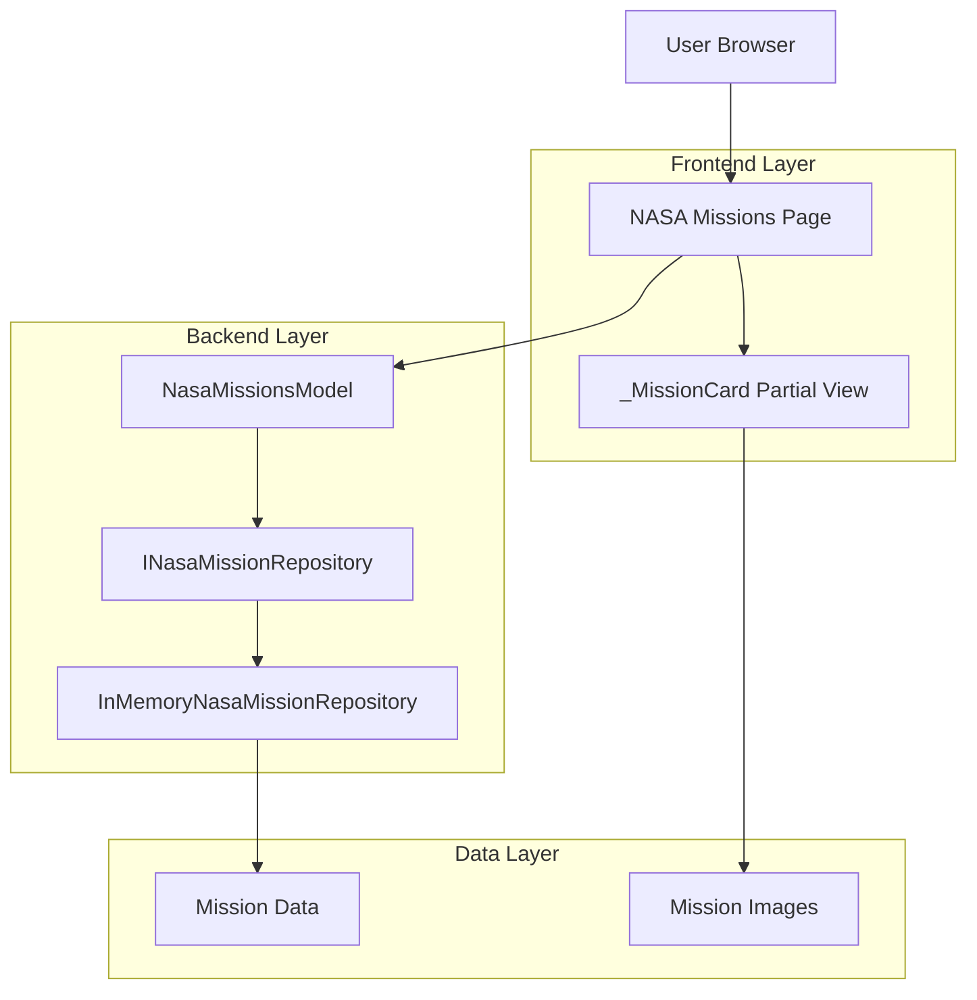

# NASA Missions Page Enhancement

## Document Information

| Attribute | Value |
|----------|-------|
| Document Title | NASA Missions Page Enhancement |
| Author | Enterprise Solution Architect AI Agent |
| Review Status | Not Reviewed |
| Last Updated | 2024 |

## Context and Goals

### Business Objectives
- Enhance the SpaceGeeks website with a comprehensive display of important NASA missions
- Provide educational content about significant space exploration milestones
- Improve user engagement with rich mission-specific information

### Functional Requirements
- Display a curated list of important NASA missions
- Show mission details including name, description, launch date, status, and image
- Handle missing mission images gracefully with fallback mechanism
- Order missions chronologically by launch date

### Non-Functional Requirements
- All new code must have appropriate unit tests
- All tests must pass successfully
- Implementation must follow existing architectural patterns
- Code must maintain consistency with existing codebase style and structure

### Constraints
- Implementation must be done within the existing ASP.NET Core Razor Pages framework
- Must integrate with existing data repository patterns
- Must follow existing testing approaches

### Assumptions
- The existing infrastructure and deployment processes will remain unchanged
- No database changes are required as data is stored in-memory
- Image assets will be managed separately

## Architecture Overview

### Component Layers
- **Experience Layer**: NASA Missions Page (Razor Page), Mission Card Partial View
- **Process Layer**: NasaMissionsModel (Page Model)
- **Adapter Layer**: INasaMissionRepository, InMemoryNasaMissionRepository

### Trust Boundaries
- Client browser to web server (HTTPS)
- Web server to in-memory data store (process memory)

## Component Design

### NASA Missions Page (NasaMissions.cshtml)

**Responsibility**: Render the NASA missions page with a grid of mission cards

**Dependencies**:
- NasaMissionsModel for data retrieval
- _MissionCard partial view for rendering individual missions

### NASA Missions Page Model (NasaMissions.cshtml.cs)

**Responsibility**: Retrieve and prepare NASA mission data for display

**Public Interface**:
- `IReadOnlyList<NasaMission> Missions` - Property containing ordered missions
- `void OnGet()` - Page handler that populates missions

**Dependencies**:
- INasaMissionRepository for data access

### NASA Mission Repository (InMemoryNasaMissionRepository.cs)

**Responsibility**: Provide access to NASA mission data from in-memory collection

**Public Interface**:
- `IReadOnlyList<NasaMission> GetAllOrderedByLaunchDate()` - Returns missions ordered by launch date

**Dependencies**: None

### Mission Card Partial View (_MissionCard.cshtml)

**Responsibility**: Render individual mission information in a consistent card format

**Dependencies**:
- NasaMission model for data binding
- Image assets in wwwroot/images

## Data Design

### Data Classification
- **NASA Mission Data**: Public (educational content)
- **Image Assets**: Public

### Data Structure
The NasaMission record contains:
- Name (string)
- Description (string)
- LaunchDate (DateTime)
- EndDate (DateTime?)
- Status (string)
- ImagePath (string)

### Data Storage
- Mission data is stored in-memory in the InMemoryNasaMissionRepository
- Image assets are stored as static files in wwwroot/images

## Security Design

### Input Validation
- No direct user input is processed by this feature
- Image paths are predefined in the data model

### Content Security
- All content is static educational information
- Image loading includes error handling with fallbacks

## Non-Functional Requirements

### Performance
- Page load time: < 2 seconds
- Memory usage: Minimal (in-memory data store)

### Availability
- Inherits availability characteristics of the hosting application
- No external dependencies affect availability

### Scalability
- Scales with the main application
- In-memory data store has minimal overhead

### Observability
- Standard application logging will capture page access
- Error conditions will be logged through standard mechanisms

## Failure Modes and Resilience

### Image Loading Failures
- Graceful degradation through onerror attribute
- Fallback to placeholder image

### Data Access Failures
- In-memory repository has no external dependencies
- Minimal risk of failure

## Deployment and Operations

### Deployment Approach
- Standard deployment with the rest of the application
- No special deployment steps required

### Configuration
- No special configuration required
- Uses existing application settings

## Implementation Plan

### Changes to Existing Components

#### InMemoryNasaMissionRepository.cs
- Add additional important NASA missions to the `_missions` collection
- Maintain existing mission data

#### Test Updates
- Update NasaMissionRepositoryTests.cs to account for increased mission count
- Update NasaMissionsPageTests.cs to verify all missions are displayed

### New Components
No new components required; enhancement of existing functionality.

## Testing Strategy

### Unit Tests
- Repository tests to verify correct mission data and ordering
- Page model tests to verify data retrieval

### Integration Tests
- Page load tests to verify successful rendering
- Content verification tests to ensure all missions are displayed
- Image error handling tests to verify fallback mechanism

### Test Coverage Goals
- 100% of new mission data should be verified in tests
- All existing functionality should continue to pass tests
- Image fallback mechanism should be tested

## Rollout Plan

1. Add new missions to InMemoryNasaMissionRepository
2. Update existing tests to accommodate new mission count
3. Verify all tests pass
4. Deploy through standard CI/CD pipeline

## Risks and Mitigations

| Risk | Likelihood | Impact | Mitigation |
|------|------------|--------|------------|
| Incorrect mission data | Low | Medium | Peer review of data accuracy |
| Image loading failures | Medium | Low | Robust fallback mechanism |
| Test failures | Low | High | Comprehensive test coverage |
| Performance degradation | Low | Low | In-memory data store minimizes impact |

## Success Criteria

- All unit and integration tests pass
- NASA missions page loads successfully
- All missions are displayed in chronological order
- Image fallback mechanism works correctly
- No regression in existing functionality

This design enhances the existing NASA missions page by adding more important missions while maintaining the established architectural patterns and ensuring comprehensive test coverage.