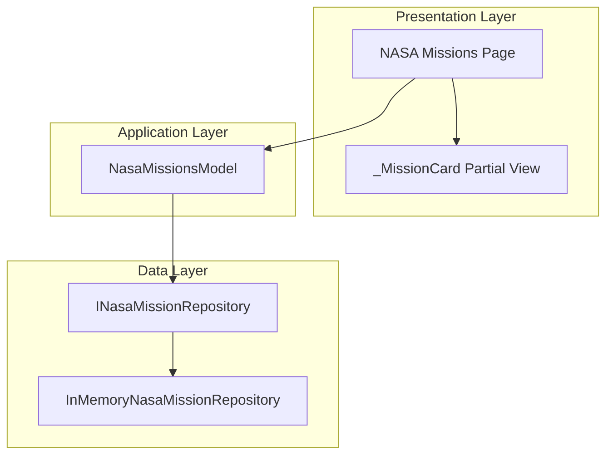

# NASA Missions Page Enhancement

## Overview

This document describes the architecture for enhancing the NASA Missions page in the SpaceGeeks application with filtering capabilities and improved visual design while ensuring comprehensive test coverage.

## Context and Goals

### Goals
- Implement filtering functionality to allow users to filter NASA missions by status (Active, Completed, Failed)
- Improve the visual design of mission cards for better user experience
- Enhance unit and integration tests to ensure quality and reliability
- Maintain backward compatibility with existing functionality

### Non-Goals
- Changing the data source or repository structure
- Adding new mission data beyond what's currently in the in-memory repository
- Modifying other pages or components outside the NASA Missions page

### Assumptions and Constraints
- The application follows the existing ASP.NET Razor Pages architecture
- Data remains in the in-memory repository for simplicity
- All enhancements should follow existing coding standards and patterns
- Tests must pass before merging changes

## Architecture Overview

The NASA Missions page enhancement involves modifications to the presentation layer (Razor Pages) and associated tests. The core data layer remains unchanged, maintaining the existing repository pattern.



## Component Design

### NasaMissionsModel (Page Model)
- **Responsibility**: Handle page requests, apply filtering logic, and provide data to the view
- **Public Interface**: 
  - `IReadOnlyList<NasaMission> Missions` - Collection of missions to display
  - `string? StatusFilter` - Filter parameter for mission status
  - `void OnGet()` - Page handler method
- **Dependencies**: `INasaMissionRepository` for data access

### _MissionCard Partial View
- **Responsibility**: Render individual mission cards with improved visual design
- **Public Interface**: Accepts a `NasaMission` model parameter
- **Dependencies**: None

### CSS Styles
- **Responsibility**: Provide enhanced styling for mission cards and filtering UI
- **Dependencies**: None

## Data Design

No changes to data structures or storage. The existing `NasaMission` record and in-memory repository remain unchanged:

```csharp
public sealed record NasaMission(
    string Name,
    string Description,
    DateTime LaunchDate,
    DateTime? EndDate,
    string Status,           // Active, Completed, Failed
    string ImagePath         // relative URL to static asset
);
```

## API and Contract Design

The page maintains the same URL route `/NasaMissions` but adds query parameter support for filtering:
- `/NasaMissions` - Display all missions (existing behavior)
- `/NasaMissions?status=Active` - Display only active missions
- `/NasaMissions?status=Completed` - Display only completed missions
- `/NasaMissions?status=Failed` - Display only failed missions

## Security Design

No security implications as this is a read-only enhancement to an existing public page. All existing security measures remain in place.

## Non-Functional Requirements

### Performance
- Page load times should remain under 100ms for filtered results
- Client-side filtering interaction should be immediate

### Usability
- Filtering controls should be intuitive and clearly labeled
- Visual design should be responsive across device sizes
- Error handling for invalid filter parameters

### Testability
- Unit tests for filtering logic in page model
- Integration tests for page rendering with filters
- Visual regression tests for card design (where applicable)

## Failure Modes and Resilience

- Invalid filter parameters default to showing all missions
- Missing images gracefully fall back to placeholder images (existing behavior)
- Repository failures propagate as 500 errors (existing behavior)

## Testing Approach

### Unit Tests
- Test filtering logic in `NasaMissionsModel`
- Verify correct missions are returned for each status filter
- Test edge cases like invalid filter values

### Integration Tests
- Test page rendering with filter parameters
- Verify filter controls are present in HTML output
- Confirm correct missions display for each filter state

### Visual Tests
- Verify improved mission card design renders correctly
- Check responsive behavior across screen sizes

## Deployment and Operations

Changes are deployed as part of the standard web application deployment process. No additional infrastructure or configuration is required.