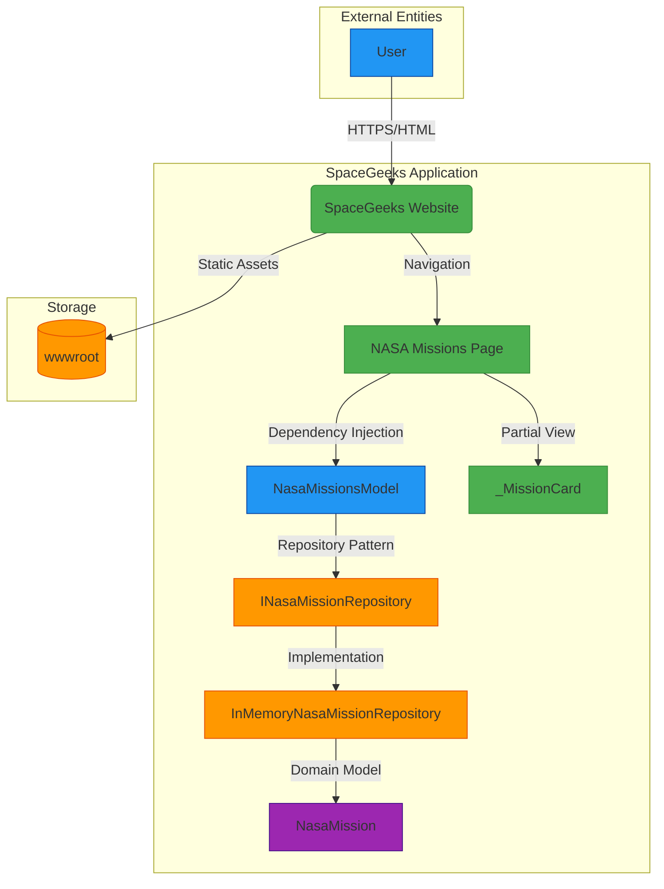
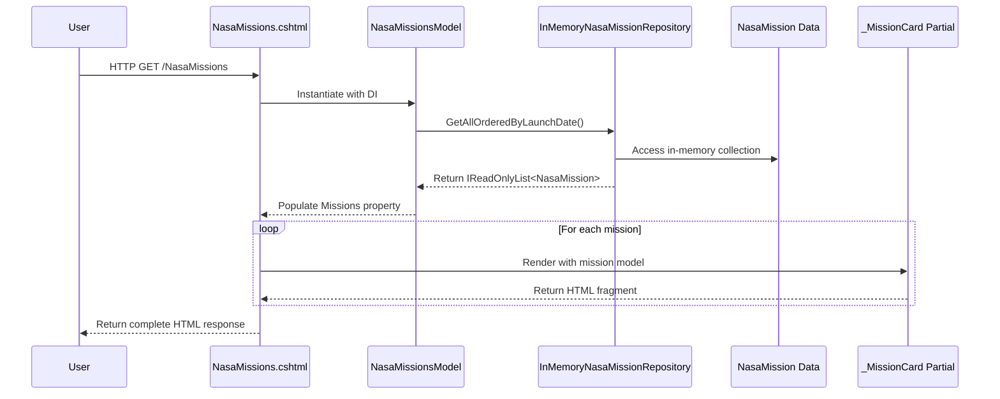

# NASA Missions Feature Integration Architecture

## 1. Overview

This document describes the integration architecture of the NASA Missions feature within the SpaceGeeks website. The feature enables users to browse important NASA space missions through a dedicated page that integrates seamlessly with the existing planetary content.

The integration follows the established architectural patterns of the SpaceGeeks application, utilizing dependency injection, the repository pattern, and Razor Pages for server-side rendering.

## 2. System Context



## 3. Integration Points

### 3.1 User Interface Integration

The NASA Missions feature integrates with the existing user interface through:

1. **Navigation Menu**: A link to the NASA Missions page is added to the main navigation in `_Layout.cshtml`
2. **Consistent Styling**: Uses the same CSS classes and styling approach as the existing planet cards
3. **Responsive Design**: Inherits responsive behavior from the existing grid layout system

### 3.2 Backend Integration

The feature integrates with the backend through:

1. **Dependency Injection**: The `INasaMissionRepository` is registered in `Program.cs` and injected into `NasaMissionsModel`
2. **Repository Pattern**: Follows the same pattern as `IPlanetRepository` for data access
3. **Page Model Architecture**: Uses the same Razor Pages pattern as other pages in the application

## 4. Data Flow

### 4.1 Request Processing Flow



### 4.2 Data Transformation

The integration involves minimal data transformation:

1. **Data Retrieval**: Missions are retrieved from the in-memory repository in chronological order
2. **No External APIs**: All data is statically defined within the application
3. **Image Handling**: Images are referenced by path with fallback handling via `onerror` attribute

## 5. Component Interfaces

### 5.1 Public Interfaces

#### INasaMissionRepository
```csharp
public interface INasaMissionRepository
{
    IReadOnlyList<NasaMission> GetAllOrderedByLaunchDate();
}
```

#### NasaMissionsModel
```csharp
public class NasaMissionsModel : PageModel
{
    public IReadOnlyList<NasaMission> Missions { get; private set; }
    
    public NasaMissionsModel(INasaMissionRepository repo)
    
    public void OnGet()
}
```

### 5.2 Component Interactions

1. **Page to Model**: The Razor page instantiates the page model through dependency injection
2. **Model to Repository**: The page model calls the repository to retrieve mission data
3. **Page to Partial View**: The page iterates through missions and renders each using the `_MissionCard` partial view

## 6. Security Integration

The NASA Missions feature inherits security characteristics from the overall application:

1. **Transport Security**: All communication uses HTTPS
2. **Input Validation**: No user input is processed, eliminating injection vulnerabilities
3. **Static Content**: All content is pre-defined, preventing content injection attacks
4. **No Authentication**: The feature is publicly accessible, consistent with the rest of the site

## 7. Error Handling Integration

The feature implements graceful error handling:

1. **Image Loading Failures**: Uses `onerror` attribute to display placeholder images
2. **No Runtime Exceptions**: Since data is static and in-memory, no database or network errors occur
3. **Fallback Behavior**: Missing images gracefully degrade to placeholders without breaking the layout

## 8. Testing Integration

The feature includes comprehensive tests that integrate with the existing test framework:

1. **Unit Tests**: `NasaMissionRepositoryTests` validates repository functionality
2. **Integration Tests**: `NasaMissionsPageTests` validates end-to-end page behavior
3. **Consistency Tests**: Tests verify that all mission cards have proper error handling attributes

## 9. Performance Considerations

1. **In-Memory Data**: Fast data retrieval with no external dependencies
2. **Minimal Processing**: Simple data access and rendering with no complex transformations
3. **Caching**: Static assets are cached by the browser
4. **Scalability**: Scales with the overall application capacity

## 10. Monitoring and Observability

The feature integrates with existing observability patterns:

1. **Standard Logging**: Uses the same logging infrastructure as other pages
2. **Error Tracking**: Errors are captured by the existing error handling mechanisms
3. **Performance Metrics**: Page load times are tracked as part of overall site metrics

## 11. Deployment Integration

The feature deploys as part of the monolithic application with no additional deployment complexity:

1. **Single Artifact**: No additional services or components to deploy
2. **Configuration**: No additional configuration required
3. **Rollback**: Standard application rollback procedures apply