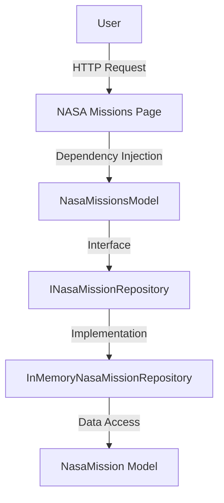
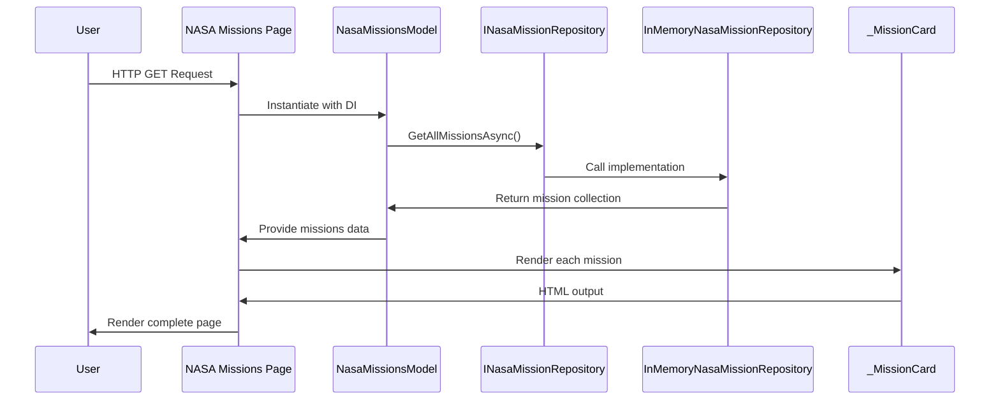

# NASA Missions Integration Architecture

## Overview

This document describes the integration architecture for the NASA Missions feature in the SpaceGeeks application. The feature displays important NASA missions to users through a dedicated page.

## System Context

## Component Details

### NasaMissions.cshtml
- Razor page responsible for rendering the NASA missions display
- Uses the NasaMissionsModel as its page model
- Includes the _MissionCard partial view for consistent mission presentation

### NasaMissionsModel
- Page model implementing dependency injection
- Constructor-injected INasaMissionRepository dependency
- Public property exposing missions for page rendering

### INasaMissionRepository
- Interface defining contract for NASA mission data access
- Single method: GetAllMissionsAsync()

### InMemoryNasaMissionRepository
- Implementation of INasaMissionRepository
- Provides in-memory storage of NASA mission data
- Returns predefined collection of NasaMission records

### NasaMission Model
- Immutable record representing a NASA mission
- Properties include Id, Name, Description, StartDate, EndDate, and ImageUrl
- Designed for thread-safe access patterns

### _MissionCard.cshtml
- Partial view for consistent rendering of mission information
- Accepts NasaMission model as input
- Provides standardized display format for all missions

## Data Flow

## Security Considerations

- No external API calls required (data is in-memory)
- No user-specific data or authentication needed
- Static content with no input validation concerns
- Follows principle of least privilege with immutable data models

## Error Handling

- Repository implementation designed for reliability with in-memory data
- Page model handles potential exceptions from repository gracefully
- Mission card partial view designed to handle null/missing properties

## Testing Integration

- Unit tests cover NasaMissionsModel functionality
- Integration tests verify page rendering with real dependencies
- Repository implementation tested for data integrity
- Mission card partial view tested for proper rendering

## Deployment Considerations

- No additional infrastructure requirements
- In-memory repository suitable for current scale
- No external service dependencies
- Minimal resource overhead