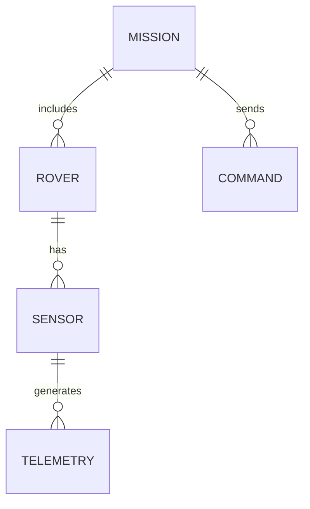

# NASA Missions Updated Data Design

## Data Model Overview

The updated data design for NASA missions incorporates enhanced telemetry collection and processing capabilities.

## Entity Relationships

## Data Flow

1. Sensors collect telemetry data
2. Data is transmitted to ground stations
3. Ground stations process and store data
4. Processed data is made available to mission control