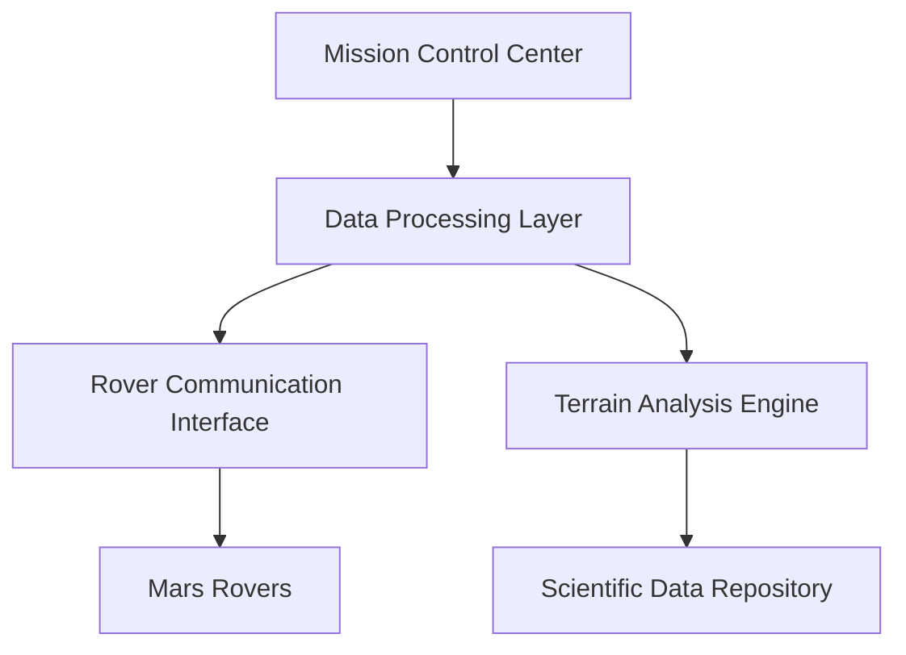

# NASA Missions Updated Logical Architecture

## Component Overview

The logical architecture has been enhanced to support additional rover missions and improved data processing.

## System Components

## Component Descriptions

- Mission Control Center: Central hub for mission operations
- Data Processing Layer: Handles data transformation and analysis
- Rover Communication Interface: Manages telemetry and command transmission