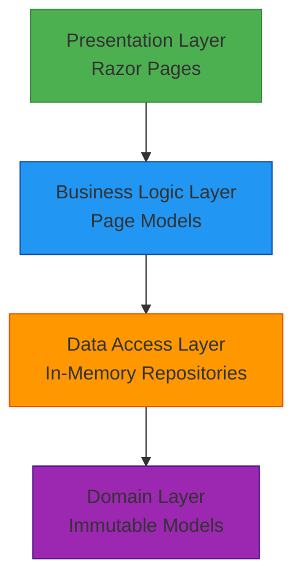
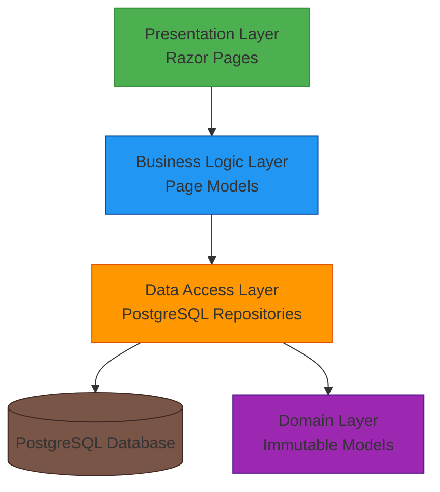

# PostgreSQL Migration - High-Level Design

## 1. Overview

This document describes the architectural changes required to migrate the SpaceGeeks application from in-memory data repositories to PostgreSQL database storage. The migration maintains the existing repository pattern while introducing persistent data storage capabilities.

## 2. Requirements

### Functional Requirements
- Replace in-memory data storage with PostgreSQL database persistence
- Maintain existing data models and repository interfaces
- Ensure data integrity and consistency
- Support CRUD operations for both Planet and NASA Mission entities

### Non-Functional Requirements
- Maintain application performance comparable to in-memory storage
- Ensure secure database connections
- Support transactional consistency
- Enable horizontal scalability
- Provide monitoring and observability for database operations

## 3. Existing Architecture

The current architecture uses in-memory repositories with a layered design:



Key components:
- **InMemoryPlanetRepository**: Stores planet data in a static array
- **InMemoryNasaMissionRepository**: Stores NASA mission data in a static array
- **Dependency Injection**: Repositories registered as singletons in Program.cs

## 4. Proposed Architecture

The proposed architecture introduces PostgreSQL persistence while maintaining the repository pattern:



### Key Changes
1. **Repository Implementation**: Replace in-memory repositories with PostgreSQL implementations
2. **Database Layer**: Introduce PostgreSQL database for data persistence
3. **Connection Management**: Add database connection configuration and management
4. **Data Mapping**: Map domain models to database tables

## 5. Required Changes

### 5.1 New Components

#### PostgreSQL Database
- **Purpose**: Persistent storage for planet and NASA mission data
- **Technology**: PostgreSQL relational database
- **Schema**: Tables for planets and NASA missions
- **Hosting**: Can be hosted locally, in cloud, or containerized

#### Database Connection Management
- **Purpose**: Manage database connections and configuration
- **Technology**: .NET's built-in database connection management
- **Configuration**: Connection strings in appsettings.json

### 5.2 Existing Components to Modify

#### Program.cs
- **Current Responsibility**: Register in-memory repositories as singletons
- **Required Change**: Register PostgreSQL repositories instead
- **Example**:
  ```csharp
  // Before
  builder.Services.AddSingleton<IPlanetRepository, InMemoryPlanetRepository>();
  
  // After
  builder.Services.AddScoped<IPlanetRepository, PostgreSqlPlanetRepository>();
  ```

#### Data Access Layer
- **Current Responsibility**: Provide data access through in-memory collections
- **Required Change**: Implement repository interfaces with PostgreSQL operations
- **Components to Modify**:
  - Create `PostgreSqlPlanetRepository` implementing `IPlanetRepository`
  - Create `PostgreSqlNasaMissionRepository` implementing `INasaMissionRepository`

### 5.3 Data Changes

#### Database Schema
Two tables will be created to match the existing domain models:

**Planets Table**
```sql
CREATE TABLE planets (
    id SERIAL PRIMARY KEY,
    name VARCHAR(100) NOT NULL,
    diameter_km DOUBLE PRECISION NOT NULL,
    mass_kg DOUBLE PRECISION NOT NULL,
    distance_from_sun_km DOUBLE PRECISION NOT NULL,
    number_of_moons INTEGER NOT NULL,
    orbital_period_days DOUBLE PRECISION NOT NULL,
    image_path VARCHAR(255) NOT NULL
);
```

**NasaMissions Table**
```sql
CREATE TABLE nasa_missions (
    id SERIAL PRIMARY KEY,
    name VARCHAR(100) NOT NULL,
    description TEXT NOT NULL,
    launch_date DATE NOT NULL,
    end_date DATE NULL,
    status VARCHAR(50) NOT NULL,
    image_path VARCHAR(255) NOT NULL
);
```

#### Data Migration
Initial data population will be required to migrate existing in-memory data to the database.

### 5.4 Configuration Changes

#### appsettings.json
Add database connection configuration:
```json
{
  "ConnectionStrings": {
    "SpaceGeeksDb": "Host=localhost;Database=spacegeeks;Username=spacegeeks;Password=spacegeeks"
  }
}
```

#### Program.cs
Add database service registration:
```csharp
builder.Services.AddDbContext<SpaceGeeksDbContext>(options =>
    options.UseNpgsql(builder.Configuration.GetConnectionString("SpaceGeeksDb")));
```

### 5.5 Security Changes

#### Database Authentication
- Implement secure database connection strings
- Use environment-specific configuration for credentials
- Consider using managed identities or secret management services in production

#### Data Protection
- Ensure data in transit is encrypted using TLS
- Apply principle of least privilege for database access
- Implement proper error handling to avoid leaking database information

### 5.6 Observability Changes

#### Logging
- Add structured logging for database operations
- Include performance metrics for queries
- Log connection failures and retries

#### Monitoring
- Monitor database connection pool usage
- Track query performance and execution times
- Set up alerts for database connectivity issues

## 6. Implementation Plan

### Phase 1: Infrastructure Setup
1. Add PostgreSQL NuGet packages (Npgsql.EntityFrameworkCore.PostgreSQL)
2. Create database context and entity models
3. Configure connection strings
4. Set up database schema creation/migration mechanism

### Phase 2: Repository Implementation
1. Implement PostgreSqlPlanetRepository
2. Implement PostgreSqlNasaMissionRepository
3. Update dependency injection registration
4. Test repository functionality

### Phase 3: Data Migration
1. Create initial data seeding mechanism
2. Migrate existing in-memory data to database
3. Validate data integrity

### Phase 4: Testing and Validation
1. Update existing tests to work with new repositories
2. Add database-specific tests
3. Performance testing
4. Integration testing

## 7. Deployment Considerations

### Database Provisioning
- Local development: Docker container or local PostgreSQL installation
- Production: Managed PostgreSQL service (Azure Database for PostgreSQL, AWS RDS, etc.)

### Connection Management
- Use connection pooling for performance
- Configure appropriate timeout values
- Implement retry logic for transient failures

### Backward Compatibility
- Ensure seamless transition from in-memory to database repositories
- Consider feature flags for controlled rollout

## 8. Risks and Mitigations

### Risk: Database Connectivity Issues
**Mitigation**: Implement circuit breaker pattern and graceful degradation

### Risk: Performance Degradation
**Mitigation**: Proper indexing, query optimization, and caching strategies

### Risk: Data Loss During Migration
**Mitigation**: Comprehensive backup strategy and validation procedures

### Risk: Security Vulnerabilities
**Mitigation**: Secure connection strings, parameterized queries, and regular security audits

## 9. Architecture Decisions

### Decision: Repository Pattern Preservation
**Rationale**: Maintaining the repository pattern ensures minimal impact on existing business logic and maintains testability.

### Decision: PostgreSQL Choice
**Rationale**: PostgreSQL offers robust features, strong community support, and ACID compliance suitable for this application's needs.

### Decision: Entity Framework Core
**Rationale**: EF Core provides ORM capabilities that simplify data access while maintaining performance and flexibility.