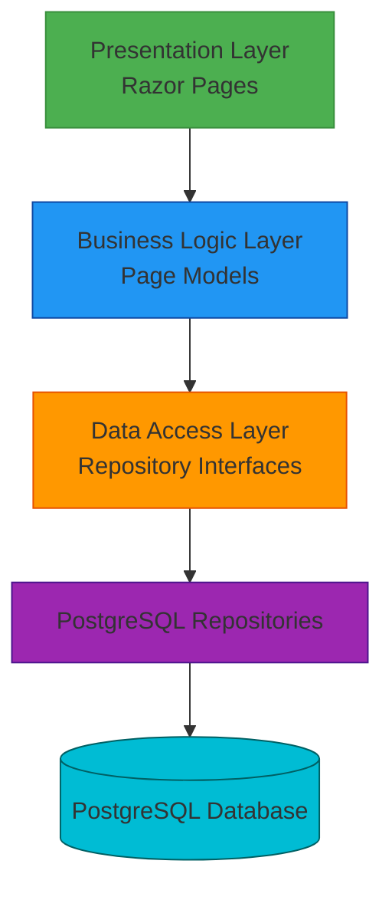

# PostgreSQL Migration - High-Level Design

## 1. Overview

This document describes the architectural changes required to migrate the SpaceGeeks website from in-memory data repositories to PostgreSQL database storage. This migration will enable persistent data storage, support for larger datasets, and better scalability while maintaining the existing application architecture and user experience.

## 2. Requirements

### 2.1 Functional Requirements
- Replace in-memory data storage with PostgreSQL database persistence
- Maintain existing data models and repository interfaces
- Ensure data integrity and consistency
- Support CRUD operations for both Planet and NasaMission entities
- Enable future data expansion without application code changes

### 2.2 Non-Functional Requirements
- Maintain existing performance characteristics
- Ensure data persistence across application restarts
- Support horizontal scaling with shared database
- Implement proper connection management and pooling
- Provide transactional consistency for data operations
- Maintain backward compatibility with existing APIs

## 3. Existing Architecture

### 3.1 Current Data Storage Approach
The SpaceGeeks application currently uses in-memory repositories for data storage:
- `InMemoryPlanetRepository` stores planet data in a static collection
- `InMemoryNasaMissionRepository` stores NASA mission data in a static collection
- Data is initialized at application startup and lost when the process terminates
- Repositories implement interfaces (`IPlanetRepository`, `INasaMissionRepository`) for abstraction

### 3.2 Repository Pattern Implementation
The application follows the repository pattern with clear separation between interfaces and implementations:
- Interfaces define contracts for data access operations
- In-memory implementations provide the current functionality
- Dependency injection is used to wire implementations to interfaces
- Page models depend only on interfaces, not concrete implementations

### 3.3 Current Deployment Model
The application is deployed as a self-contained executable with no external dependencies:
- All data is embedded within the application process
- No external database or service dependencies
- Simple deployment model with single executable

## 4. Proposed Architecture

### 4.1 Database Design
Two tables will be created to store the application data:

#### Planets Table
```sql
CREATE TABLE planets (
    id SERIAL PRIMARY KEY,
    name VARCHAR(100) NOT NULL UNIQUE,
    diameter_km DOUBLE PRECISION NOT NULL,
    mass_kg DOUBLE PRECISION NOT NULL,
    distance_from_sun_km DOUBLE PRECISION NOT NULL,
    number_of_moons INTEGER NOT NULL,
    orbital_period_days DOUBLE PRECISION NOT NULL,
    image_path VARCHAR(255) NOT NULL
);
```

#### NasaMissions Table
```sql
CREATE TABLE nasa_missions (
    id SERIAL PRIMARY KEY,
    name VARCHAR(100) NOT NULL UNIQUE,
    description TEXT NOT NULL,
    launch_date DATE NOT NULL,
    end_date DATE NULL,
    status VARCHAR(20) NOT NULL,
    image_path VARCHAR(255) NOT NULL
);
```

### 4.2 New Component Architecture
The migration will introduce PostgreSQL-based repository implementations while preserving existing interfaces:



### 4.3 Connection Management
- Use connection pooling for efficient database connection management
- Implement proper connection lifecycle management
- Configure connection timeouts and retry policies
- Use environment-specific connection strings

## 5. Required Changes

### 5.1 New Components

#### PostgreSQLPlanetRepository
- **Purpose**: PostgreSQL implementation of `IPlanetRepository`
- **Responsibilities**: 
  - Connect to PostgreSQL database
  - Execute queries to retrieve planet data
  - Map database results to `Planet` domain objects
  - Handle database connection lifecycle

#### PostgreSQLNasaMissionRepository
- **Purpose**: PostgreSQL implementation of `INasaMissionRepository`
- **Responsibilities**: 
  - Connect to PostgreSQL database
  - Execute queries to retrieve NASA mission data
  - Map database results to `NasaMission` domain objects
  - Handle database connection lifecycle

#### Database Initialization Service
- **Purpose**: Initialize database schema and seed initial data
- **Responsibilities**:
  - Create tables if they don't exist
  - Seed initial planet and NASA mission data
  - Handle database migrations (future enhancement)

### 5.2 Existing Components to Modify

#### Program.cs
- **Current**: Registers in-memory repository implementations
- **Change**: Register PostgreSQL repository implementations instead
- **Reason**: Switch dependency injection to use database-backed repositories

#### Application Configuration
- **Current**: No database configuration required
- **Change**: Add PostgreSQL connection string configuration
- **Reason**: Enable environment-specific database connections

### 5.3 Data Changes

#### Schema Creation
- Create SQL scripts to define table schemas
- Define appropriate data types and constraints
- Add indexes for frequently queried columns

#### Data Migration
- Develop scripts to migrate existing in-memory data to PostgreSQL
- Ensure data integrity during migration
- Validate migrated data matches original in-memory data

#### Seeding Strategy
- Implement data seeding for fresh installations
- Ensure consistent initial data across environments
- Handle updates to seed data appropriately

### 5.4 Configuration Changes

#### Connection Strings
Add PostgreSQL connection string to `appsettings.json`:
```json
{
  "ConnectionStrings": {
    "SpaceGeeksDb": "Host=localhost;Database=spacegeeks;Username=spacegeeks;Password=spacegeeks"
  }
}
```

#### Environment Configuration
- Support different connection strings for Development, Staging, and Production
- Use environment variables for sensitive configuration values
- Implement configuration validation

### 5.5 Security Changes

#### Database Authentication
- Implement proper database user authentication
- Use least-privilege database users
- Store credentials securely (environment variables/secrets)

#### Connection Security
- Use SSL/TLS for database connections in production
- Implement connection timeout and retry policies
- Validate connection strings and prevent injection attacks

### 5.6 Deployment Changes

#### Database Provisioning
- Add PostgreSQL database provisioning to deployment process
- Include database initialization in deployment
- Handle database schema updates during deployment

#### Container Deployment
Update Docker configuration to include:
- PostgreSQL database service
- Proper networking between application and database
- Volume mounting for data persistence

### 5.7 Test Impact

#### Unit Tests
- Update repository tests to work with PostgreSQL implementations
- Mock database connections where appropriate
- Ensure test data isolation

#### Integration Tests
- Add database integration tests
- Test connection management and error handling
- Validate data persistence and retrieval

#### Performance Tests
- Benchmark database operations against in-memory operations
- Test connection pooling effectiveness
- Validate scalability improvements

## 6. Implementation Approach

### 6.1 Phase 1: Foundation
1. Add PostgreSQL NuGet package dependencies
2. Create database context and connection management
3. Implement basic repository skeletons
4. Set up database configuration

### 6.2 Phase 2: Implementation
1. Implement full PostgreSQL repository functionality
2. Create database schema and migration scripts
3. Implement data seeding
4. Update dependency injection configuration

### 6.3 Phase 3: Testing and Validation
1. Update unit tests for new implementations
2. Add integration tests for database operations
3. Validate data integrity and performance
4. Test deployment scenarios

### 6.4 Phase 4: Deployment
1. Deploy to staging environment
2. Validate functionality with real database
3. Performance testing and optimization
4. Production deployment

## 7. Architecture Decisions

### 7.1 Repository Pattern Preservation
**Decision**: Maintain existing repository interfaces and patterns
**Rationale**: 
- Preserves existing application architecture
- Enables gradual migration without breaking changes
- Maintains testability through interface mocking
- Allows for future repository implementations

### 7.2 PostgreSQL Choice
**Decision**: Use PostgreSQL as the database engine
**Rationale**:
- Open-source and widely supported
- Good performance for read-heavy workloads
- Strong data integrity features
- Cross-platform compatibility

### 7.3 Connection Management
**Decision**: Use built-in .NET connection pooling
**Rationale**:
- Reduces connection overhead
- Improves performance under load
- Simplifies connection lifecycle management
- Built-in reliability features

## 8. Risks and Considerations

### 8.1 Performance Impact
- Database queries may be slower than in-memory access
- Network latency for database operations
- Mitigation: Connection pooling, indexing, and query optimization

### 8.2 Deployment Complexity
- Added database dependency increases deployment complexity
- Need for database backup and recovery procedures
- Mitigation: Containerized deployment, automated provisioning

### 8.3 Data Migration
- Risk of data loss during migration
- Need to maintain data consistency
- Mitigation: Thorough testing, backup procedures, validation scripts

### 8.4 Scalability
- Single database instance may become bottleneck
- Connection pool limitations
- Mitigation: Database connection optimization, future clustering options

## 9. Summary of Required Changes

- ADD PostgreSQL NuGet package dependencies
- ADD PostgreSQL repository implementations
- ADD database schema creation scripts
- ADD data seeding functionality
- MODIFY `Program.cs` to register PostgreSQL repositories
- MODIFY `appsettings.json` to include database connection strings
- CONFIGURE environment-specific database settings
- UPDATE unit and integration tests for new implementations
- UPDATE deployment configuration to provision PostgreSQL database