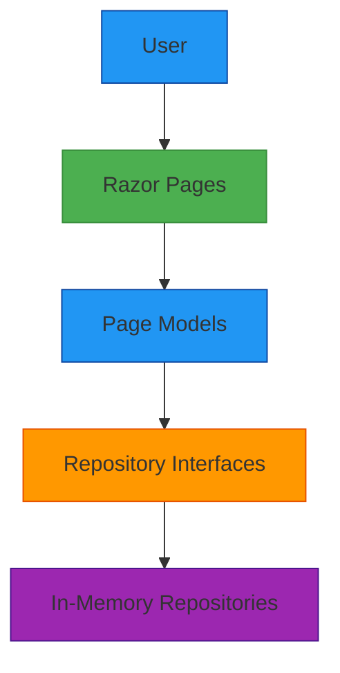
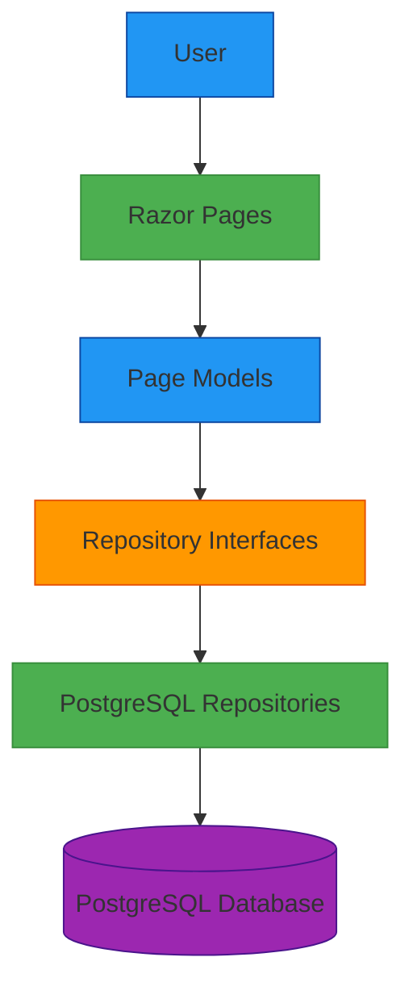

# PostgreSQL Repositories - High-Level Design

## 1. Overview

This document describes the architectural changes required to replace the in-memory data repositories with PostgreSQL database implementations in the SpaceGeeks application. The change maintains the existing repository pattern while introducing persistent data storage.

## 2. Requirements

### Functional Requirements
- Replace in-memory planet and NASA mission data storage with PostgreSQL database
- Maintain existing data access interfaces and contracts
- Ensure all existing functionality continues to work without modification
- Provide robust error handling for database connectivity issues

### Non-Functional Requirements
- Maintain application performance comparable to in-memory implementation
- Ensure database connection security
- Provide monitoring and observability for database operations
- Support deployment with external PostgreSQL database
- Maintain testability of repository implementations

## 3. Existing Architecture

The current architecture uses a clean repository pattern:



Key components:
- `IPlanetRepository` and `INasaMissionRepository` interfaces define data access contracts
- `InMemoryPlanetRepository` and `InMemoryNasaMissionRepository` provide static data
- Dependency injection wires repositories into page models
- All data is immutable and loaded at application startup

## 4. Proposed Architecture

The proposed architecture introduces PostgreSQL-based repositories while preserving existing interfaces:



### Key Changes
1. **Data Layer**: Replace in-memory collections with PostgreSQL database
2. **Repository Implementation**: Implement repositories using Entity Framework Core
3. **Configuration**: Add database connection string management
4. **Dependencies**: Add Entity Framework Core PostgreSQL provider

## 5. Detailed Design

### 5.1 Data Model Mapping

#### Planet Entity
Maps the existing `Planet` record to a database table:

```csharp
public class PlanetEntity
{
    public int Id { get; set; }
    public string Name { get; set; }
    public double DiameterKm { get; set; }
    public double MassKg { get; set; }
    public double DistanceFromSunKm { get; set; }
    public int NumberOfMoons { get; set; }
    public double OrbitalPeriodDays { get; set; }
    public string ImagePath { get; set; }
}
```

#### NASA Mission Entity
Maps the existing `NasaMission` record to a database table:

```csharp
public class NasaMissionEntity
{
    public int Id { get; set; }
    public string Name { get; set; }
    public string Description { get; set; }
    public DateTime LaunchDate { get; set; }
    public DateTime? EndDate { get; set; }
    public string Status { get; set; }
    public string ImagePath { get; set; }
}
```

### 5.2 Database Context

```csharp
public class SpaceGeeksDbContext : DbContext
{
    public DbSet<PlanetEntity> Planets { get; set; }
    public DbSet<NasaMissionEntity> NasaMissions { get; set; }
    
    public SpaceGeeksDbContext(DbContextOptions<SpaceGeeksDbContext> options) : base(options) { }
    
    protected override void OnModelCreating(ModelBuilder modelBuilder)
    {
        // Configure entity mappings
        modelBuilder.Entity<PlanetEntity>(entity =>
        {
            entity.HasKey(e => e.Id);
            entity.Property(e => e.Name).IsRequired();
            // Additional configuration
        });
        
        modelBuilder.Entity<NasaMissionEntity>(entity =>
        {
            entity.HasKey(e => e.Id);
            entity.Property(e => e.Name).IsRequired();
            // Additional configuration
        });
    }
}
```

### 5.3 Repository Implementations

#### PostgreSQL Planet Repository
```csharp
public class PostgreSQLPlanetRepository : IPlanetRepository
{
    private readonly SpaceGeeksDbContext _context;
    
    public PostgreSQLPlanetRepository(SpaceGeeksDbContext context)
    {
        _context = context;
    }
    
    public IReadOnlyList<Planet> GetAllOrderedByDistance()
    {
        return _context.Planets
            .OrderBy(p => p.DistanceFromSunKm)
            .AsNoTracking()
            .Select(p => new Planet(
                p.Name,
                p.DiameterKm,
                p.MassKg,
                p.DistanceFromSunKm,
                p.NumberOfMoons,
                p.OrbitalPeriodDays,
                p.ImagePath))
            .ToList()
            .AsReadOnly();
    }
}
```

#### PostgreSQL NASA Mission Repository
```csharp
public class PostgreSQLNasaMissionRepository : INasaMissionRepository
{
    private readonly SpaceGeeksDbContext _context;
    
    public PostgreSQLNasaMissionRepository(SpaceGeeksDbContext context)
    {
        _context = context;
    }
    
    public IReadOnlyList<NasaMission> GetAllOrderedByLaunchDate()
    {
        return _context.NasaMissions
            .OrderBy(m => m.LaunchDate)
            .AsNoTracking()
            .Select(m => new NasaMission(
                m.Name,
                m.Description,
                m.LaunchDate,
                m.EndDate,
                m.Status,
                m.ImagePath))
            .ToList()
            .AsReadOnly();
    }
}
```

### 5.4 Dependency Injection Configuration

Update `Program.cs` to register the new repositories:

```csharp
// Add Entity Framework Core
builder.Services.AddDbContext<SpaceGeeksDbContext>(options =>
    options.UseNpgsql(builder.Configuration.GetConnectionString("SpaceGeeksDb")));

// Replace in-memory repositories with PostgreSQL implementations
builder.Services.AddScoped<IPlanetRepository, PostgreSQLPlanetRepository>();
builder.Services.AddScoped<INasaMissionRepository, PostgreSQLNasaMissionRepository>();
```

### 5.5 Configuration

Add connection string to `appsettings.json`:

```json
{
  "ConnectionStrings": {
    "SpaceGeeksDb": "Host=localhost;Database=spacegeeks;Username=spacegeeks;Password=spacegeeks"
  }
}
```

## 6. Database Schema

### Planets Table
```sql
CREATE TABLE Planets (
    Id SERIAL PRIMARY KEY,
    Name VARCHAR(100) NOT NULL,
    DiameterKm DOUBLE PRECISION NOT NULL,
    MassKg DOUBLE PRECISION NOT NULL,
    DistanceFromSunKm DOUBLE PRECISION NOT NULL,
    NumberOfMoons INTEGER NOT NULL,
    OrbitalPeriodDays DOUBLE PRECISION NOT NULL,
    ImagePath VARCHAR(255) NOT NULL
);
```

### NASA Missions Table
```sql
CREATE TABLE NasaMissions (
    Id SERIAL PRIMARY KEY,
    Name VARCHAR(100) NOT NULL,
    Description TEXT NOT NULL,
    LaunchDate DATE NOT NULL,
    EndDate DATE NULL,
    Status VARCHAR(50) NOT NULL,
    ImagePath VARCHAR(255) NOT NULL
);
```

## 7. Security Considerations

### Connection Security
- Use encrypted connections (SSL/TLS) to PostgreSQL
- Store connection strings securely (environment variables, Azure Key Vault, etc.)
- Use least-privilege database users

### Data Protection
- Validate all inputs to prevent SQL injection
- Use parameterized queries through Entity Framework Core
- Implement proper error handling to avoid exposing database details

## 8. Deployment Considerations

### Database Provisioning
- Require external PostgreSQL database (version 12+)
- Create database schema using Entity Framework migrations
- Seed initial data during first deployment

### Configuration Management
- Manage connection strings per environment
- Use environment-specific configuration files
- Implement configuration validation

### Migration Strategy
- Create initial migration for schema creation
- Plan for future schema changes
- Implement rollback procedures

## 9. Monitoring and Observability

### Health Checks
```csharp
builder.Services.AddHealthChecks()
    .AddNpgSql(builder.Configuration.GetConnectionString("SpaceGeeksDb"));
```

### Logging
- Enable EF Core query logging for debugging
- Log database connection events
- Monitor query performance

## 10. Testing Strategy

### Unit Tests
- Mock `SpaceGeeksDbContext` for repository unit tests
- Test repository methods with in-memory database provider
- Validate data mapping between entities and domain models

### Integration Tests
- Use test database instance for integration tests
- Seed test data before each test run
- Test database connectivity and query execution

## 11. Rollback Plan

If issues are encountered with the PostgreSQL implementation:
1. Revert to in-memory repositories by updating dependency injection configuration
2. Restore previous `Program.cs` configuration
3. Remove Entity Framework Core dependencies if necessary
4. Deploy reverted version

## 12. Performance Considerations

### Caching Strategy
- Implement in-memory caching for frequently accessed data
- Use Redis or similar for distributed caching in scaled environments
- Configure appropriate cache expiration policies

### Query Optimization
- Use `AsNoTracking()` for read-only queries
- Create database indexes on sorted columns
- Monitor slow queries and optimize as needed

## 13. Required Implementation Changes

### MODIFY Existing Files
- `SpaceGeeks/Program.cs` - Update dependency injection and add EF Core configuration
- `SpaceGeeks/appsettings.json` - Add connection string configuration

### ADD New Files
- `SpaceGeeks/Data/Entities/PlanetEntity.cs` - Planet database entity
- `SpaceGeeks/Data/Entities/NasaMissionEntity.cs` - NASA mission database entity
- `SpaceGeeks/Data/SpaceGeeksDbContext.cs` - Database context
- `SpaceGeeks/Data/PostgreSQLPlanetRepository.cs` - PostgreSQL planet repository implementation
- `SpaceGeeks/Data/PostgreSQLNasaMissionRepository.cs` - PostgreSQL NASA mission repository implementation
- Database migration files

### UPDATE Test Files
- `SpaceGeeks.Tests/NasaMissionRepositoryTests.cs` - Update to work with PostgreSQL implementation
- `SpaceGeeks.Tests/PlanetRepositoryTests.cs` - Update to work with PostgreSQL implementation
- Integration tests may require test database setup

## 14. Dependencies

### NuGet Package Dependencies
- `Npgsql.EntityFrameworkCore.PostgreSQL` - Entity Framework Core provider for PostgreSQL
- `Microsoft.EntityFrameworkCore.Tools` - EF Core tools for migrations (development only)

### External Dependencies
- PostgreSQL database server (version 12 or later)
- Network connectivity between application and database
- Database user with appropriate permissions

## 15. Risks and Mitigations

### Risk: Database Connectivity Issues
**Mitigation**: Implement robust error handling and health checks

### Risk: Performance Degradation
**Mitigation**: Implement caching and query optimization

### Risk: Data Migration Failures
**Mitigation**: Thorough testing of migration scripts and rollback procedures

### Risk: Security Vulnerabilities
**Mitigation**: Use parameterized queries, encrypted connections, and secure credential management