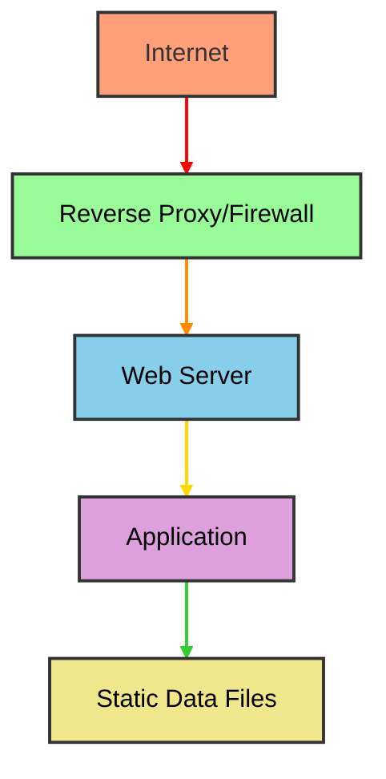

# Security Architecture

## Overview

This document outlines the security architecture for the SpaceGeeks website, covering threat models, security controls, and best practices for maintaining a secure educational platform.

## Threat Model

### Assets to Protect
1. **User Data**: Browsing habits and interaction patterns
2. **Application Integrity**: Correctness of educational content
3. **System Availability**: Continuous access to educational resources
4. **Reputation**: Trustworthiness of provided information

### Identified Threats
1. **Content Tampering**: Unauthorized modification of celestial object data
2. **Denial of Service**: Overwhelming the server with requests
3. **Information Disclosure**: Exposure of internal system details
4. **Malicious Input**: Cross-site scripting or injection attacks
5. **Data Integrity**: Corruption of educational content

## Security Controls

### Defense in Depth Strategy

### Network Security
- **HTTPS Enforcement**: Automatic redirection from HTTP to HTTPS
- **HSTS Headers**: Strict transport security for modern browsers
- **Content Security Policy**: Restrict sources of executable content
- **Rate Limiting**: Prevent abuse through request throttling

### Application Security
- **Input Validation**: Built-in ASP.NET Core request validation
- **Output Encoding**: Razor's automatic HTML encoding prevents XSS
- **Anti-Forgery Tokens**: Protection against CSRF attacks
- **Secure Headers**: X-Frame-Options, X-Content-Type-Options, etc.

### Data Security
- **Immutable Data**: Static files reduce attack surface
- **Access Controls**: File system permissions limit data access
- **Integrity Checks**: Version control ensures data authenticity
- **No Secrets**: No sensitive credentials in codebase

## Authentication and Authorization

### Current State
- **Public Access**: No user authentication required
- **Read-Only**: No user-generated content or modifications
- **Anonymous Usage**: Privacy-preserving browsing experience

### Future Considerations
If user accounts are introduced:
- **Multi-Factor Authentication**: Enhanced account security
- **Role-Based Access**: Different permissions for educators/students
- **Session Management**: Secure token handling
- **Audit Logging**: Track user activities

## Data Protection

### Data Classification
- **Public Data**: Celestial object information (no privacy concerns)
- **Usage Data**: Anonymous analytics (if implemented)
- **No Personal Data**: No collection of personally identifiable information

### Data Handling Principles
1. **Minimization**: Collect only necessary data
2. **Transparency**: Clear disclosure of data usage
3. **Retention**: No persistent storage of user data
4. **Portability**: Easy export of any user-contributed content

## Secure Development Practices

### Code Security
- **Static Analysis**: Regular code scanning for vulnerabilities
- **Dependency Scanning**: Monitor for vulnerable packages
- **Security Testing**: Include security tests in CI/CD pipeline
- **Code Reviews**: Manual inspection for security issues

### Configuration Security
- **Environment Variables**: Separate configuration from code
- **Secrets Management**: External secret storage for any credentials
- **Secure Defaults**: Safe configuration out of the box
- **Configuration Validation**: Verify settings at startup

## Compliance Considerations

### Educational Standards
- **Accessibility**: WCAG compliance for inclusive education
- **Accuracy**: Peer-reviewed astronomical data sources
- **Attribution**: Proper credit for data sources

### Privacy Regulations
- **GDPR**: No personal data collection means minimal compliance burden
- **COPPA**: No targeting of children requires no special handling
- **CCPA**: No personal data sale or sharing

## Incident Response

### Detection
- **Monitoring**: Log analysis for unusual activity patterns
- **Alerting**: Automated notifications for security events
- **Auditing**: Regular security assessments

### Response Procedures
1. **Containment**: Isolate affected systems
2. **Investigation**: Determine scope and impact
3. **Eradication**: Remove malicious components
4. **Recovery**: Restore from clean backups
5. **Lessons Learned**: Update procedures based on findings

## Security Testing

### Automated Testing
- **Unit Tests**: Verify security controls function correctly
- **Integration Tests**: Test end-to-end security flows
- **Vulnerability Scanners**: Regular automated security scans
- **Dependency Checks**: Monitor for known vulnerabilities

### Manual Testing
- **Penetration Testing**: Annual third-party security assessments
- **Code Reviews**: Security-focused manual code inspection
- **Threat Modeling**: Regular reassessment of threat landscape

## Monitoring and Logging

### Security Events
- **Authentication Attempts**: Track login successes/failures
- **Authorization Failures**: Log access denied incidents
- **Input Validation Failures**: Record malformed requests
- **System Anomalies**: Monitor for unusual behavior patterns

### Log Management
- **Centralized Logging**: Aggregate logs for analysis
- **Retention Policies**: Maintain logs for compliance
- **Access Controls**: Restrict log access to authorized personnel
- **Log Integrity**: Prevent tampering with audit trails

## Third-Party Components

### Risk Assessment
- **Vetting Process**: Evaluate security practices of vendors
- **License Compliance**: Ensure proper licensing of components
- **Maintenance Status**: Verify active maintenance of dependencies

### Security Maintenance
- **Regular Updates**: Keep components current with security patches
- **Vulnerability Monitoring**: Subscribe to security bulletins
- **Replacement Planning**: Identify alternatives for deprecated components

## Future Security Enhancements

### Short-term Goals
1. **Security Headers**: Implement comprehensive security header policy
2. **Subresource Integrity**: Validate CDN-hosted resources
3. **Referrer Policy**: Control information leakage through referrers

### Long-term Goals
1. **Zero Trust Architecture**: Implement comprehensive identity verification
2. **Advanced Threat Protection**: Machine learning-based anomaly detection
3. **End-to-End Encryption**: Encrypt data in transit and at rest
4. **Security Automation**: Self-healing security responses

## Conclusion

The SpaceGeeks website's security architecture focuses on simplicity and defense in depth. By maintaining a read-only, static-content model, the attack surface is minimized while still providing rich educational content. As the platform evolves, additional security measures will be implemented to maintain the highest standards of data protection and user safety.