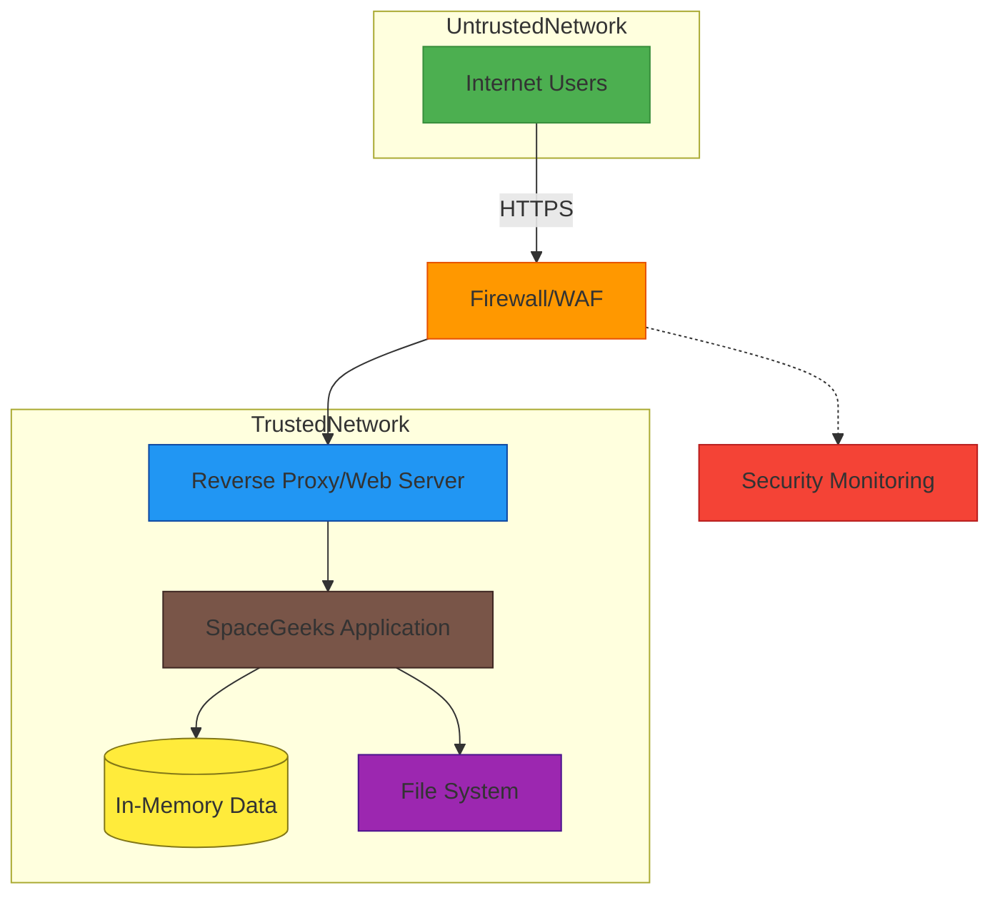

# Security Architecture

## Security Diagram

## Security Principles

The SpaceGeeks website follows these core security principles:

1. **Defense in Depth** - Multiple layers of security controls
2. **Least Privilege** - Minimal necessary permissions for all components
3. **Secure by Design** - Security considerations integrated from the beginning
4. **Fail Securely** - Systems default to secure state when errors occur
5. **Keep It Simple** - Simpler systems are easier to secure

## Threat Model

### Assets
1. **Celestial Data** - Educational content about planets, stars, and constellations
2. **User Sessions** - Information about user interactions with the site
3. **Application Code** - Source code and compiled binaries
4. **Server Infrastructure** - Hardware and software hosting the application

### Threats
1. **Data Tampering** - Unauthorized modification of celestial information
2. **Denial of Service** - Overwhelming the server with requests
3. **Information Disclosure** - Exposure of sensitive system information
4. **Malicious File Execution** - Running unauthorized code on the server
5. **Cross-Site Scripting (XSS)** - Injecting malicious scripts into web pages
6. **Cross-Site Request Forgery (CSRF)** - Forcing users to execute unwanted actions

### Attack Surfaces
1. **Web Interface** - User-facing pages and forms
2. **API Endpoints** - Any programmatic interfaces (future consideration)
3. **Static Assets** - Images, CSS, and JavaScript files
4. **Server Configuration** - Web server and application settings

## Security Controls

### Network Security

#### Firewall
- Restrict inbound connections to HTTP/HTTPS ports only
- Block direct access to internal ports and services
- Implement rate limiting to prevent abuse

#### Web Application Firewall (WAF)
- Filter malicious requests based on known attack patterns
- Monitor for SQL injection attempts
- Detect and block cross-site scripting attacks

#### Transport Security
- Enforce HTTPS for all connections
- Use modern TLS protocols (TLS 1.2+)
- Implement HTTP Strict Transport Security (HSTS)
- Configure secure cipher suites

### Application Security

#### Input Validation
- Validate all user inputs at the application boundary
- Sanitize data before processing or display
- Use parameterized queries for any database interactions (future consideration)
- Implement proper encoding for HTML, JavaScript, and CSS output

#### Authentication and Authorization
- Currently not required as the site serves public educational content
- Design future features with authentication in mind
- Implement role-based access control if administrative features are added

#### Session Management
- Use secure, randomly generated session identifiers
- Implement proper session timeout mechanisms
- Protect against session fixation attacks

#### Error Handling
- Display generic error messages to users
- Log detailed error information securely
- Prevent information leakage through error responses

#### Secure Coding Practices
- Keep ASP.NET Core framework updated
- Use built-in security features of the framework
- Implement proper exception handling
- Avoid hardcoding sensitive information

### Data Security

#### Data Integrity
- Store data in version-controlled source code
- Implement checksums for critical data files
- Use immutable data structures where possible

#### Data Confidentiality
- Since celestial data is public educational content, encryption is not required
- Protect any future user data with appropriate encryption
- Securely store any configuration secrets

#### Data Availability
- Implement regular backups of the application and data
- Design for fault tolerance and quick recovery
- Monitor system health and performance

### File System Security

#### Permissions
- Run the web application with minimal necessary privileges
- Restrict file system access to required directories only
- Set appropriate read/write permissions for different file types

#### Static Content
- Serve static assets through the web server, not directly from the file system
- Validate file extensions and MIME types
- Implement proper caching headers

## Security Monitoring

### Logging
- Log all security-relevant events
- Include sufficient context for forensic analysis
- Protect log files from tampering
- Retain logs for appropriate periods

### Intrusion Detection
- Monitor for unusual access patterns
- Alert on repeated failed requests
- Track file access and modification

### Vulnerability Management
- Regularly scan for known vulnerabilities
- Keep all components updated
- Subscribe to security bulletins for dependencies

## Compliance Considerations

### Accessibility
- Ensure the website meets WCAG 2.1 AA standards
- Test with screen readers and other assistive technologies
- Provide alternative text for images

### Privacy
- Currently no personal data collection
- If user data is collected in future, implement appropriate privacy controls
- Comply with applicable privacy regulations (GDPR, CCPA, etc.)

## Incident Response

### Preparation
- Document security procedures and contacts
- Establish communication channels for security incidents
- Prepare incident response playbooks

### Detection and Analysis
- Monitor logs and alerts continuously
- Investigate potential security events promptly
- Classify incidents by severity and impact

### Containment and Eradication
- Isolate affected systems to prevent further damage
- Remove malicious code or unauthorized access
- Patch vulnerabilities that led to the incident

### Recovery
- Restore systems from clean backups if necessary
- Verify system integrity before returning to service
- Monitor for signs of re-infection

### Post-Incident Activity
- Document lessons learned
- Update security controls based on findings
- Communicate with stakeholders as appropriate

## Future Security Enhancements

1. **Content Security Policy (CSP)** - Implement CSP headers to prevent XSS
2. **Security Headers** - Add additional security headers (X-Frame-Options, X-Content-Type-Options)
3. **Rate Limiting** - Implement more sophisticated rate limiting
4. **Security Scanning** - Integrate automated security scanning in CI/CD pipeline
5. **Penetration Testing** - Conduct periodic penetration testing