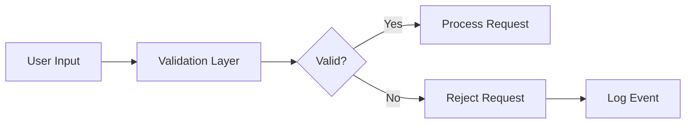

# Security Architecture

## Overview

The SpaceGeeks website follows security best practices for a read-only informational website. As a static content site with no user authentication or sensitive data processing, the security focus is on protecting against common web vulnerabilities and ensuring secure delivery of content.

## Security Principles

1. **Defense in Depth** - Multiple layers of security controls
2. **Principle of Least Privilege** - Minimal permissions for all components
3. **Secure by Design** - Security considerations integrated from the start
4. **Fail Securely** - Graceful degradation when security controls fail

## Threat Model

### Identified Threats

1. **Cross-Site Scripting (XSS)**
   - Risk: Malicious scripts injected into web pages
   - Impact: Session hijacking, data theft

2. **Cross-Site Request Forgery (CSRF)**
   - Risk: Unauthorized commands executed on behalf of users
   - Impact: Unintended actions performed

3. **Injection Attacks**
   - Risk: Malicious data executed as commands
   - Impact: Data exposure, system compromise

4. **Information Disclosure**
   - Risk: Sensitive information exposed
   - Impact: Privacy violations, competitive disadvantage

5. **Denial of Service**
   - Risk: Resource exhaustion preventing legitimate access
   - Impact: Service unavailability

## Security Controls

### Input Validation

- Server-side validation for all inputs
- Strong typing prevents many injection attacks
- Razor Pages automatic encoding protects against XSS

### Authentication and Authorization

- No user authentication currently required
- All content publicly accessible
- Future user features would implement proper authentication

### Data Protection

- HTTPS encryption for data in transit
- No sensitive data storage
- Static assets served securely

### Secure Configuration

- HTTP headers configured for security
- Secure cookie settings
- Debug mode disabled in production

## Implementation Details

### ASP.NET Core Security Features

1. **Anti-Forgery Tokens**
   - Built-in protection against CSRF attacks
   - Automatic for form posts in Razor Pages

2. **Content Encoding**
   - Razor automatically encodes output
   - Prevents XSS vulnerabilities

3. **Header Security**
   - Security headers configured in middleware
   - Protection against clickjacking and other attacks

4. **Request Validation**
   - Built-in validation prevents dangerous input
   - Custom validation for domain-specific rules

### Static Asset Security

- Images and CSS/JS files served securely
- No executable content in static assets
- File integrity checks where applicable

## Vulnerability Management

### Dependency Scanning
- Regular scans for vulnerable NuGet packages
- Automated alerts for security updates
- Patch management process

### Code Reviews
- Security-focused code reviews
- Peer review of all changes
- Automated static analysis

### Penetration Testing
- Annual security assessments
- Third-party vulnerability testing
- Bug bounty program consideration

## Monitoring and Incident Response

### Security Logging
- Audit trail of security-relevant events
- Failed request logging
- Anomalous activity detection

### Incident Response
- Security incident response plan
- Contact procedures for security team
- Containment and remediation processes

## Compliance Considerations

### GDPR
- No personal data collection
- No cookies requiring consent
- Right to erasure automatically satisfied

### Accessibility
- WCAG 2.1 AA compliance
- Screen reader compatibility
- Keyboard navigation support

## Future Security Enhancements

### Enhanced Security Headers
- Content Security Policy (CSP)
- Subresource Integrity (SRI)
- Referrer Policy improvements

### Rate Limiting
- Request throttling to prevent abuse
- DDoS protection measures
- API rate limiting (if APIs are added)

### Security Monitoring
- Real-time threat detection
- Behavioral analytics
- Security information and event management (SIEM)

## Security Testing

### Automated Testing
- Static application security testing (SAST)
- Dynamic application security testing (DAST)
- Dependency vulnerability scanning

### Manual Testing
- Penetration testing
- Security code reviews
- Architecture security assessments

## Training and Awareness

### Developer Training
- Secure coding practices
- OWASP Top 10 awareness
- Framework-specific security features

### Security Updates
- Regular security bulletins
- Patch management procedures
- Emergency response protocols