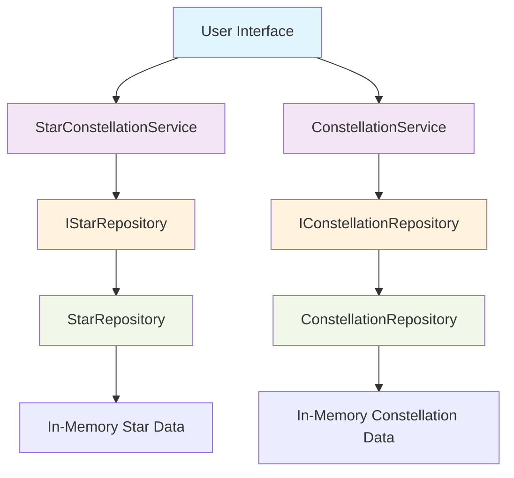

# Stars and Constellations Logical Architecture

## Overview

The logical architecture for the Stars and Constellations feature follows the established SpaceGeeks pattern with a clean separation of concerns. It utilizes ASP.NET Core Razor Pages with C# records for data modeling and in-memory repositories for data access.

## Component Diagram



## Components Description

### Presentation Layer

#### Star Pages
- `Stars/Index.cshtml` - List all stars with search and filter capabilities
- `Stars/Details.cshtml` - Detailed view of individual star information
- `Stars/Search.cshtml` - Advanced search interface for stars

#### Constellation Pages
- `Constellations/Index.cshtml` - Browse constellations by category or alphabetically
- `Constellations/Details.cshtml` - Detailed constellation information with star mapping
- `Constellations/SkyMap.cshtml` - Interactive visualization of constellation in the sky

#### Shared Components
- `_StarCardPartial.cshtml` - Reusable star display component
- `_ConstellationCardPartial.cshtml` - Reusable constellation display component
- Layout and navigation integration with existing site

### Application Layer

#### StarConstellationService
Handles operations related to individual stars:
- Retrieving star information by various criteria
- Calculating derived properties (absolute magnitude, etc.)
- Managing star search and filter functionality

#### ConstellationService
Manages constellation-related operations:
- Retrieving constellation details and associated stars
- Providing cultural and historical context
- Generating constellation sky maps

### Domain Layer

#### Star Record
Immutable C# record representing a star:
```csharp
public record Star(
    int Id,
    string Name,
    string BayerDesignation,
    double RightAscension,
    double Declination,
    double ApparentMagnitude,
    double AbsoluteMagnitude,
    string SpectralClass,
    double DistanceInLightYears,
    string ConstellationId);
```

#### Constellation Record
Immutable C# record representing a constellation:
```csharp
public record Constellation(
    string Id,
    string Name,
    string LatinName,
    string Abbreviation,
    string Family,
    string Origin,
    string Meaning,
    List<int> StarIds);
```

### Infrastructure Layer

#### IStarRepository Interface
Defines contract for star data access:
- GetAllStars()
- GetStarById(int id)
- GetStarsByConstellation(string constellationId)
- SearchStars(string searchTerm)

#### IConstellationRepository Interface
Defines contract for constellation data access:
- GetAllConstellations()
- GetConstellationById(string id)
- GetConstellationsByFamily(string family)

#### StarRepository Implementation
In-memory implementation of IStarRepository:
- Loads star data at application startup
- Provides efficient lookup by various criteria
- Implements search and filter algorithms

#### ConstellationRepository Implementation
In-memory implementation of IConstellationRepository:
- Loads constellation data at application startup
- Links constellations to their constituent stars
- Provides categorization by family and origin

## Data Flow

1. User navigates to Stars or Constellations section
2. Razor Page handler calls appropriate service
3. Service retrieves data from repository
4. Repository accesses in-memory data store
5. Service processes and returns data to page model
6. Page renders data using Razor syntax and partial views
7. User interacts with rendered content

## Dependencies

### External Dependencies
- ASP.NET Core Framework
- Built-in dependency injection container
- Standard web browser technologies (HTML, CSS, JavaScript)

### Internal Dependencies
- Shared layout and styling from main SpaceGeeks site
- Common utility functions (if any exist)
- Site navigation components

## Scalability Considerations

The current architecture supports:
- Easy addition of new star or constellation data
- Extension of search and filter capabilities
- Addition of new presentation formats
- Replacement of in-memory repositories with persistent storage

## Security Considerations

As a read-only feature:
- No user input validation required beyond standard web practices
- No authentication or authorization needed for public access
- Protection against XSS through Razor's automatic encoding