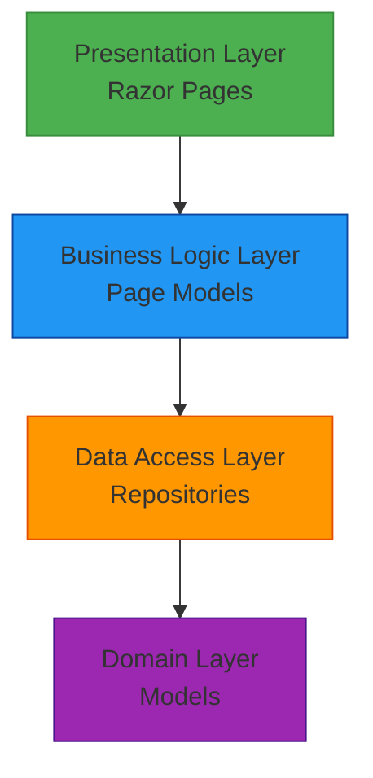
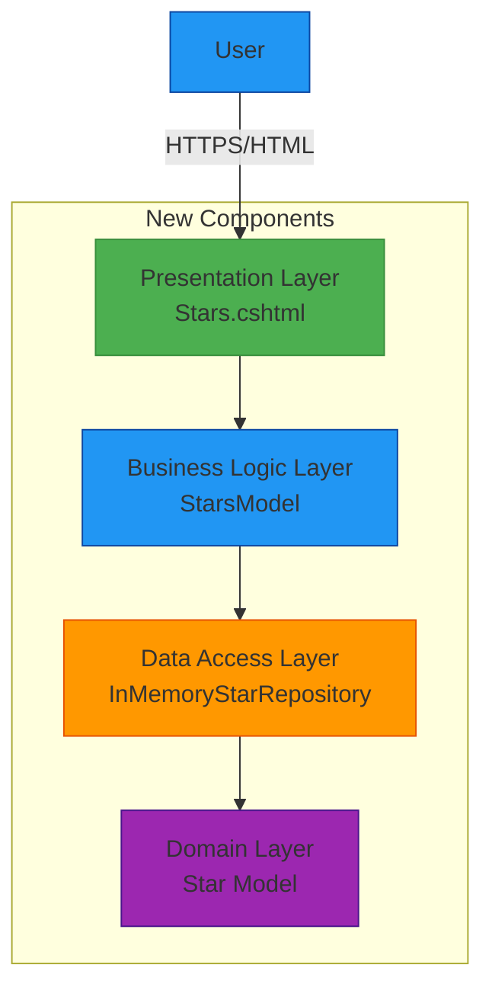

# Stars Page Feature - High-Level Design

## 1. Overview

This document describes the architecture design for adding a new Stars page to the SpaceGeeks website. This feature will showcase information about notable stars in our galaxy, following the same architectural patterns as the existing Planets and NASA Missions pages.

## 2. Requirements

### Functional Requirements
- Display a collection of notable stars with their key astronomical properties
- Provide a dedicated page accessible via navigation menu
- Implement responsive design consistent with existing pages
- Include proper error handling for image loading failures
- Follow existing data modeling and presentation patterns

### Non-Functional Requirements
- Maintain consistency with existing website architecture
- Ensure all new code is covered by comprehensive unit and integration tests
- Follow existing performance and accessibility standards
- Maintain the same deployment model as the existing application

## 3. Existing Architecture

The SpaceGeeks application follows a traditional layered architecture pattern:

Key architectural characteristics:
- ASP.NET Core 8 with Razor Pages
- In-memory data storage using repository pattern
- Dependency injection for component wiring
- Immutable domain models using C# records
- Bootstrap 5 for responsive UI
- Comprehensive test coverage using xUnit

## 4. Proposed Architecture

The Stars page feature will extend the existing architecture by adding new components that follow the established patterns:

## 5. Required Changes

### New Components

#### Star Model
A new immutable domain model representing a star with its key astronomical properties:
- Name
- Spectral class
- Solar mass
- Solar radius
- Distance from Earth (light years)
- Constellation
- Image path

#### Star Repository
A new repository implementation following the existing pattern:
- Interface `IStarRepository` defining data access contract
- `InMemoryStarRepository` implementation with static star data
- Registration with dependency injection container

#### Stars Page
A new Razor Page following the existing pattern:
- `Stars.cshtml` for presentation
- `Stars.cshtml.cs` for page model logic
- Navigation link in the main layout

#### Stars Card Partial
A reusable partial view for consistent star presentation:
- `_StarCard.cshtml` following the pattern of existing card components
- Consistent styling with planet and mission cards

### Existing Components to Modify

#### Layout Navigation
Update `Pages/Shared/_Layout.cshtml` to include a navigation link to the new Stars page:
- Add "Stars" link to the main navigation menu
- Position appropriately in the navigation flow

### Interfaces and API Changes
No API changes are required as this is a server-side rendered page with no external APIs.

### Data Changes
New static star data will be added to the in-memory repository:
- Approximately 10-15 notable stars with accurate astronomical data
- Image assets for each star (following existing naming conventions)
- No changes to existing data structures or persistence mechanisms

### Configuration and Infrastructure Changes
No configuration or infrastructure changes are required as the feature uses the existing deployment model.

### Security Changes
No security changes are required as the feature follows the same security model as existing pages.

### Observability Changes
No observability changes are required as the feature will use the existing logging infrastructure.

## 6. Test Impact

### Unit Tests
New unit tests will be added for:
- `InMemoryStarRepository` to verify data access and ordering
- `Star` model to verify property assignments
- Any helper methods for star data processing

### Integration Tests
New integration tests will be added for:
- Stars page loading successfully
- Correct page title
- Display of all stars in the repository
- Proper image error handling (onerror attributes)
- Navigation to the Stars page from the home page

### Test Strategy
The testing approach will mirror existing patterns:
- Repository tests verifying data integrity
- Page model tests for business logic
- Integration tests for full stack verification
- HTML parsing tests for UI element validation

## 7. Deployment and Migration Changes

### Deployment
The feature will be deployed as part of the existing self-contained executable with no additional deployment steps required.

### Rollback
Rollback will follow the existing process by redeploying the previous version.

### Backwards Compatibility
The feature maintains full backwards compatibility as it adds new functionality without modifying existing components.

## 8. Summary of Required Changes

- ADD `SpaceGeeks.Models.Star` immutable record for star data
- ADD `SpaceGeeks.Data.IStarRepository` interface
- ADD `SpaceGeeks.Data.InMemoryStarRepository` implementation
- ADD `SpaceGeeks.Pages.StarsModel` page model
- ADD `SpaceGeeks.Pages.Stars.cshtml` page view
- ADD `SpaceGeeks.Pages.Shared._StarCard.cshtml` partial view
- MODIFY `SpaceGeeks.Pages.Shared._Layout.cshtml` to include navigation link
- ADD unit tests for new repository and model components
- ADD integration tests for the new Stars page
- ADD star image assets to `wwwroot/images/`
- REGISTER new repository in `Program.cs` dependency injection container

## 9. Architecture Decisions

### Data Storage Approach
**Decision**: Continue using in-memory data storage.
**Rationale**: 
- Consistent with existing application architecture
- Sufficient for the static nature of star data
- Simplifies deployment and maintenance
- No performance concerns with anticipated data volume

### UI Component Design
**Decision**: Follow existing card-based design patterns.
**Rationale**:
- Maintains visual consistency with planets and missions pages
- Leverages existing CSS styling
- Provides familiar user experience
- Reduces development effort and potential inconsistencies

### Navigation Integration
**Decision**: Add Stars link to main navigation menu.
**Rationale**:
- Provides clear discoverability
- Follows existing navigation patterns
- Maintains information architecture consistency

## 10. Risks and Considerations

### Performance
Minimal risk as star data will be stored in-memory similar to existing data.

### Maintainability
Low risk as the implementation follows established patterns and conventions.

### Scalability
No scalability concerns as the application already handles similar data volumes.

### Browser Compatibility
No additional compatibility concerns as the implementation uses the same technologies as existing pages.