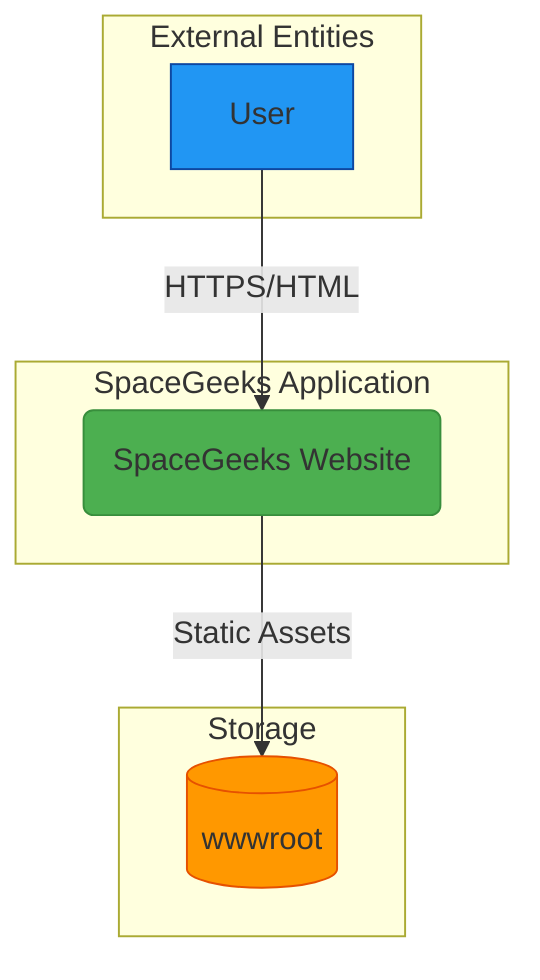

# System Context

## 1. Overview

This document describes the system context for the SpaceGeeks website, showing how the application fits within its environment and interacts with external entities.

## 2. System Context Diagram

## 3. System Description

### SpaceGeeks Website
The core application is a self-hosted ASP.NET Core web application that serves educational content about space exploration. It follows the Razor Pages pattern for server-rendered web applications.

**Key characteristics:**
- Single-process application with embedded web server
- No external database dependencies (uses in-memory data stores)
- Serves static assets (CSS, JavaScript, images) from local file system
- Stateless operation with no user sessions

### User
Represents visitors to the website who are seeking educational content about space and NASA missions.

**Responsibilities:**
- Accessing the website through a web browser
- Navigating between different sections (planets, NASA missions)
- Viewing educational content

### wwwroot (Static Assets)
Contains all static resources required by the website including CSS stylesheets, JavaScript files, and images.

**Characteristics:**
- Served directly by the web server
- No processing or transformation applied
- Cached aggressively by browsers

## 4. Trust Boundaries

There is one primary trust boundary in the system:

1. **Application Boundary**: Separates the user's browser from the SpaceGeeks application. All communication across this boundary uses HTTPS for transport security.

Within the application boundary, there are no additional trust boundaries as all components run in the same process with shared memory access.

## 5. Data Flow

1. **User Request Flow**:
   - User makes HTTP request to web server
   - Server routes request to appropriate Razor Page
   - Page model processes request and retrieves data from repositories
   - Razor view renders HTML response
   - Response sent back to user's browser

2. **Static Asset Flow**:
   - User requests static asset (CSS, JS, image)
   - Server serves file directly from wwwroot directory
   - File content sent back to user's browser

## 6. Integration Points

The SpaceGeeks website currently has no external integration points. All data is stored in-memory and all assets are served locally. This simplifies deployment and eliminates external dependencies but limits scalability for large datasets.