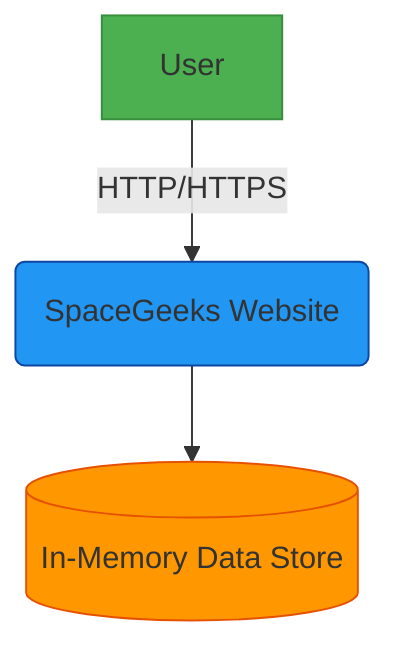

# System Context

## System Overview

The SpaceGeeks website is a single-page application built using ASP.NET Core Razor Pages. It serves static and dynamic content about celestial objects to users via web browsers.

## External Entities

### User
Represents individuals accessing the SpaceGeeks website through web browsers. Users interact with the system to learn about celestial objects including planets, stars, and constellations.

## System Components

### SpaceGeeks Website
The main web application providing information about celestial objects. Built using:
- ASP.NET Core Razor Pages
- HTML5, CSS3, JavaScript
- Bootstrap for responsive design
- In-memory data storage

Key responsibilities:
- Serving web pages to users
- Managing navigation between different sections
- Displaying information about celestial objects
- Handling user interactions

## Data Stores

### In-Memory Data Store
Current implementation stores all data in memory using C# collections. This approach is suitable for the current scale but may need to evolve as more celestial objects are added.

## Information Flows

1. **User Request Flow**:
   - User accesses website via browser
   - Browser sends HTTP request to web server
   - Server processes request and returns HTML/CSS/JS

2. **Data Access Flow**:
   - Web pages request data through repository interfaces
   - Repositories retrieve data from in-memory collections
   - Data is formatted and rendered as HTML

## Interfaces

### Web Interface
- Protocol: HTTP/HTTPS
- Format: HTML5 with embedded CSS and JavaScript
- Access Method: Standard web browser
- Security: HTTPS encryption for data in transit

## Constraints

- Hosting environment must support ASP.NET Core
- Client devices must support modern web standards
- All data must be included in the deployment package