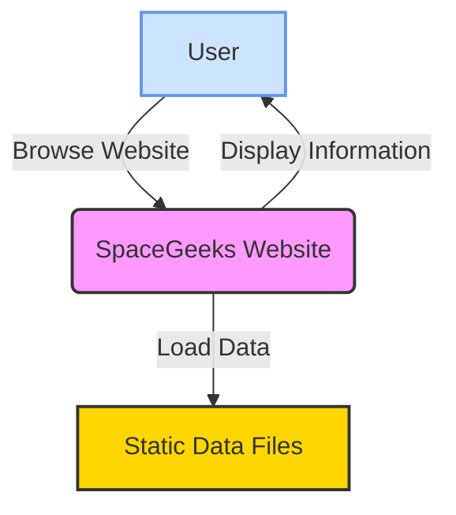

# System Context

## Overview

This document describes the system context for the SpaceGeeks website, including external entities and their relationships with the system.

## Context Diagram

## External Entities

### User
- **Description**: Visitors to the SpaceGeeks website seeking educational content about celestial objects
- **Role**: Browse and consume information about planets, stars, and constellations
- **Interfaces**: Web browser

## System Boundaries

### SpaceGeeks Website
- **Technology**: ASP.NET Core Razor Pages (.NET 7)
- **Hosting**: Web server environment
- **Responsibilities**:
  - Present educational content about celestial objects
  - Provide navigation between different celestial object categories
  - Display detailed information pages
  - Handle user interactions and requests

### Static Data Files
- **Description**: JSON/text files containing celestial object data
- **Location**: Part of the application deployment
- **Purpose**: Source of truth for all celestial object information
- **Format**: Structured data files organized by celestial object type

## Data Flow

1. User accesses the website through a web browser
2. Website loads data from static files
3. Website processes and renders information for display
4. User interacts with the rendered content
5. Website responds to user interactions by displaying appropriate content

## Assumptions

- Users have modern web browsers capable of rendering HTML, CSS, and JavaScript
- Static data files are deployed with the application
- No external APIs or services are required for core functionality
- All content is publicly accessible with no authentication requirements

## Constraints

- Data must be statically defined at deployment time
- No real-time data updates without redeployment
- Limited to information that can be effectively presented in a web browser