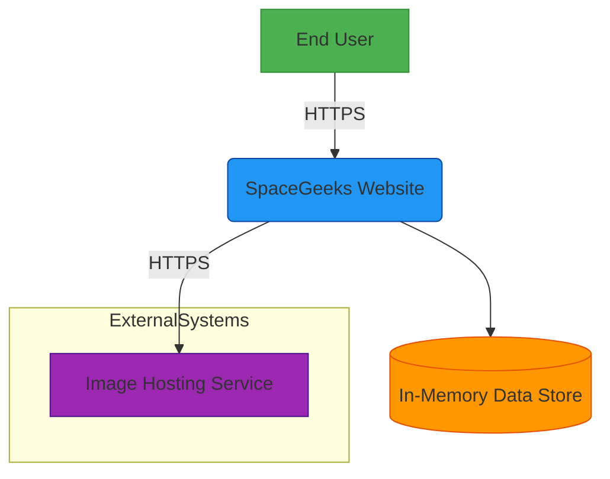

# System Context

## System Context Diagram

## System Description

The SpaceGeeks website is a web application built using ASP.NET Core Razor Pages that provides educational content about celestial objects. The system allows users to browse information about planets, stars, and constellations.

### Core Components

1. **Web Application** - The main ASP.NET Core Razor Pages application that serves web pages to users
2. **Data Layer** - In-memory data store containing information about celestial objects
3. **UI Layer** - Razor Pages and shared components for presenting information to users

### External Dependencies

1. **Image Hosting Service** - External service providing images for celestial objects (currently using local static assets)

## Interfaces

### User Interface

Users interact with the system through a web browser using HTTPS protocol. The interface provides:
- Homepage with navigation to different celestial object categories
- Browse pages for planets, stars, and constellations
- Detail pages for individual celestial objects
- Search and filtering capabilities

### Data Interface

The application accesses data through repository interfaces that abstract the data storage mechanism. Currently, all data is stored in-memory using static collections.

## Actors

### Primary Actors

1. **Astronomy Enthusiast** - Casual visitor interested in learning about celestial objects
2. **Student** - Educational user seeking information for academic purposes
3. **Teacher** - Educator looking for resources to share with students

### Supporting Actors

1. **Content Administrator** - (Future role) Responsible for maintaining and updating celestial data

## Deployment Environment

The application is designed to run in a standard ASP.NET Core hosting environment, requiring:
- .NET 6.0 or later runtime
- Web server capable of hosting ASP.NET Core applications (IIS, Kestrel, nginx, etc.)
- Static file serving capability for images and CSS/JS assets

## Security Boundaries

All communication between users and the system occurs over HTTPS. The system does not currently implement authentication or authorization mechanisms as it serves purely informational content.